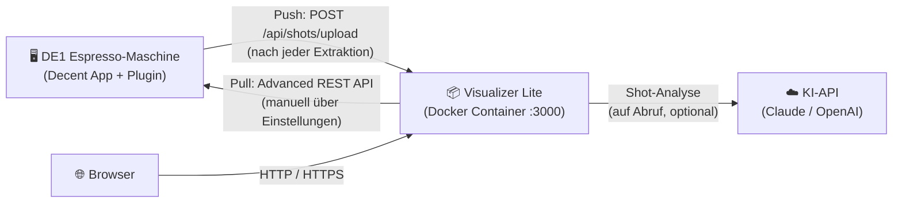
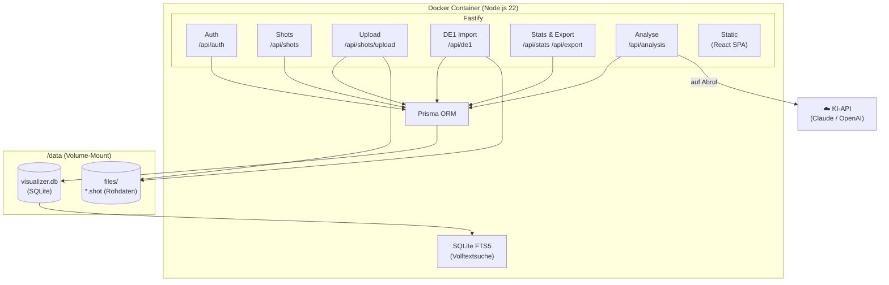
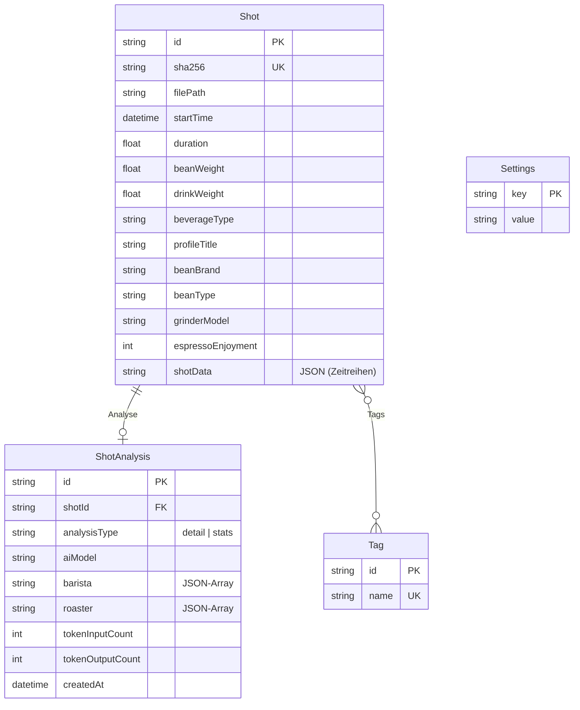

# Visualizer Lite

Selbst gehostete Espresso-Shot-Verwaltung für die [Decent Espresso DE1](https://decentespresso.com/). Jeden Shot erfassen, Extraktionskurven analysieren, Profile vergleichen und Muster über die gesamte Brühhistorie entdecken — lokal gespeichert, vollständig in deiner Hand.

---

## Warum Visualizer Lite?

Die Decent DE1 ist eine außergewöhnliche Espressomaschine — aber die Decent App auf dem Tablet sammelt im Laufe der Jahre immer mehr Shot-Daten an, und eine große Historie verlangsamt den Start. Ich wollte die Shots vom Tablet archivieren, dauerhaft zugänglich behalten und auf meine eigene Weise auswerten.

Visualizer Lite entstand aus diesem Bedarf:

- **Datenkontrolle** — alle Daten bleiben lokal; kein Cloud-Account, keine externe Serviceabhängigkeit
- **Vollständige Historie** — Shots über Jahre hinweg durchsuchen, filtern und vergleichen, nicht nur die neuesten
- **Tablet entlasten** — nach dem Import können Shots von der DE1-Maschine gelöscht werden, damit die Decent App auf dem Tablet schnell und reaktionsfreudig bleibt
- **Erweiterbarkeit** — die Daten gehören dir; exportieren, analysieren, direkt abfragen
- **Ein schönes Nebenprojekt** — ehrlich gesagt macht die Entwicklung einfach Spaß

## Key Features

- **Direktimport (Pull)** — Shots direkt von der DE1-Maschine holen mit der [Advanced REST API](https://github.com/randomcoffeesnob/decent-advanced-rest-api)-Extension; kein Kabel, keine manuelle Dateiübertragung nötig
- **Automatischer Upload (Push)** — Shots werden nach jeder Extraktion automatisch hochgeladen über das modifizierte [*Upload to visualizer*](de1app/de1plus/plugins/visualizer_upload/)-DE1-Plugin aus diesem Repository
- **Manueller Upload** — Einzelne oder mehrere `.shot`-Dateien per Drag-and-drop oder Dateiauswahl über das Web-Interface hochladen
- **Export** — Die gesamte Shot-Sammlung als ZIP-Archiv herunterladen, zur Sicherung oder für externe Analysen
- **Filterbare Shot-Liste** — Suche und Filter nach Röster, Bohne, Profil, Mahlwerk, Getränketyp und mehr
- **Statistik-Dashboard** — KPI-Kacheln mit Periodenvergleich (24h bis Gesamt), Top-Röster/Röstungen/Profile, konfigurierbarer Getränkefilter (Espresso vs. Filter); inkl. **Röster & Bohnen**- und **Profile**-Tabs mit sortierbaren Metriktabellen
- **Shot-Vergleich** — Zwei Shots überlagert oder nebeneinander mit Extraktionskurven und Kennzahlen-Diff
- **KI-Analyse (experimentell, zum Spaß)** — On-Demand Shot-Analyse über Claude oder OpenAI: **Barista**-Perspektive (Brühtechnik, Mahlgrad, Tamping) und **Röster**-Perspektive (Bohne, Röstgrad, Frische); phasenbewusst mit stabiler Sub-Phasen-Erkennung; eigener API-Key erforderlich. Die Ergebnisse sind interessant, aber nicht verbindlich — beste Resultate mit **Claude Sonnet**
- **Self-Hosted, einzelner Container** — Läuft lokal oder auf einem NAS (Synology etc.) als einzelner Docker-Container mit SQLite; keine Cloud, kein Account, volle Datenkontrolle
  - ⚠️ Kein Multi-Tenant-Support — eine Instanz, ein Benutzer
  - ⚠️ Bewusst nicht mit der Decent/Kaffee-Community verbunden (kein Teilen, kein Leaderboard)
- **DE1-Tablet entlasten** — Nach dem Import in Visualizer Lite können die Shots von der DE1-Maschine gelöscht werden, damit die Decent App auf dem Tablet schneller startet

<table>
  <tr>
    <td align="center" width="33%">
      
      <br/><sub><b>Shot-Liste</b></sub>
    </td>
    <td align="center" width="33%">
      
      <br/><sub><b>Extraktionskurven</b></sub>
    </td>
    <td align="center" width="33%">
      
      <br/><sub><b>Einstellungen &amp; Import</b></sub>
    </td>
  </tr>
  <tr>
    <td align="center" width="33%">
      
      <br/><sub><b>Shot-Vergleich — Überlagerte Kurven</b></sub>
    </td>
    <td align="center" width="33%">
      
      <br/><sub><b>Shot-Vergleich — Getrennte Ansicht</b></sub>
    </td>
    <td align="center" width="33%">
      
      <br/><sub><b>Statistik-Dashboard — 6-Monats-Ansicht</b></sub>
    </td>
  </tr>
</table>

---

## Schnellstart

Kein Build nötig — einfach das veröffentlichte Image aus der GitHub Container Registry verwenden.

**HTTP (lokales Netzwerk):**
```bash
docker run -d \
  --name visualizer-lite \
  --restart unless-stopped \
  -p 3000:3000 \
  -v /volume1/docker/visualizer-lite/data:/data \
  -e VL_SESSION_SECRET="$(openssl rand -base64 48)" \
  -e VL_PASSWORD="dein-passwort" \
  ghcr.io/tomschmidtdev/visualizer-lite:latest
```

> **Parameter-Erläuterung:**
>
> | Parameter | Was anpassen |
> |---|---|
> | `-v /volume1/docker/visualizer-lite/data:/data` | Der Pfad **links vom Doppelpunkt** gibt an, wo die Daten auf dem Host gespeichert werden. Beliebiges Verzeichnis wählen (z.B. `/home/benutzer/visualizer-daten`). Das `/data` rechts muss so bleiben. |
> | `VL_SESSION_SECRET` | Ein langer, zufälliger String zum Signieren von Login-Sessions. Generieren mit `openssl rand -base64 48` oder einem Passwort-Manager. **Geheim halten und konsistent lassen** — eine Änderung meldet alle aktiven Sessions ab. |
> | `VL_PASSWORD` | Das Login-Passwort. Starkes Passwort wählen, wenn die Instanz außerhalb des Heimnetzwerks erreichbar ist. Kann später in den App-Einstellungen geändert werden. |
> | `-p 3000:3000` | Der Zugriffsport (linke Seite). Auf z.B. `-p 8080:3000` ändern, wenn Port 3000 bereits belegt ist. |

**macOS / Windows — HTTP (lokale Nutzung):**

macOS (Terminal):
```bash
docker run -d \
  --name visualizer-lite \
  --restart unless-stopped \
  -p 3000:3000 \
  -v "$HOME/visualizer-lite-data:/data" \
  -e VL_SESSION_SECRET="$(openssl rand -base64 48)" \
  -e VL_PASSWORD="dein-passwort" \
  ghcr.io/tomschmidtdev/visualizer-lite:latest
```

Windows (PowerShell):
```powershell
docker run -d `
  --name visualizer-lite `
  --restart unless-stopped `
  -p 3000:3000 `
  -v "$env:USERPROFILE\visualizer-lite-data:/data" `
  -e "VL_SESSION_SECRET=beliebigen-langen-zufallsstring-hier-eintragen" `
  -e "VL_PASSWORD=dein-passwort" `
  ghcr.io/tomschmidtdev/visualizer-lite:latest
```

Danach im Browser öffnen: http://localhost:3000

---

> **Wann wird HTTPS benötigt?**
> Wenn Visualizer Lite nur innerhalb des Heimnetzwerks genutzt wird — also im selben Netzwerk wie die DE1 und alle Geräte, mit denen auf die App zugegriffen wird — ist reines HTTP ausreichend. Der Datenverkehr verlässt das Netzwerk nicht. HTTPS ist nur nötig, wenn die Instanz von außen erreichbar sein soll (Mobilfunk, Büro, VPN). In diesem Fall entweder ein Zertifikatsverzeichnis einbinden (wie unten gezeigt) oder einen Reverse Proxy (z.B. Nginx Proxy Manager oder Synologys eingebauten Reverse Proxy) vorschalten und den Container intern auf HTTP betreiben.

**HTTPS (mit Zertifikaten):**
```bash
docker run -d \
  --name visualizer-lite \
  --restart unless-stopped \
  -p 3443:3000 \
  -v /volume1/docker/visualizer-lite/data:/data \
  -v /volume1/docker/visualizer-lite/certs:/certs:ro \
  -e VL_SESSION_SECRET="$(openssl rand -base64 48)" \
  -e VL_PASSWORD="dein-passwort" \
  ghcr.io/tomschmidtdev/visualizer-lite:latest
```

---

## HTTP vs. HTTPS

| | HTTP | HTTPS |
|---|---|---|
| Zertifikat erforderlich | Nein | Ja |
| Geeignet für | Nur lokales Netzwerk | Internet / externer Zugriff |
| Port | 3000 | 3443 (oder beliebig) |

### HTTPS-Setup (optional)

Ein Zertifikatsverzeichnis mounten — die App aktiviert HTTPS automatisch:

```bash
docker run -d \
  --name visualizer-lite \
  --restart unless-stopped \
  -p 3443:3000 \
  -v /volume1/docker/visualizer-lite/data:/data \
  -v /volume1/docker/visualizer-lite/certs:/certs:ro \
  -e VL_SESSION_SECRET="$(openssl rand -base64 48)" \
  -e VL_PASSWORD="dein-passwort" \
  visualizer-lite:nas
```

Zertifikatsdateien ablegen unter:
```raw
/volume1/docker/visualizer-lite/certs/
├── fullchain.pem
└── privkey.pem
```

> **Synology-Tipp:** Zertifikat über *Systemsteuerung → Sicherheit → Zertifikat → Exportieren* herunterladen, dann `cat cert.pem chain.pem > fullchain.pem`.  
> Alternativ den eingebauten Reverse Proxy nutzen (*Systemsteuerung → Anmeldeportal → Erweitert*) – dann läuft der Container nur auf HTTP, HTTPS übernimmt Synology.

---

## Umgebungsvariablen

| Variable | Standard | Beschreibung |
|---|---|---|
| `VL_SESSION_SECRET` | — | **Pflicht.** Zufälliger String ≥ 32 Zeichen |
| `VL_PASSWORD` | — | Initiales Login-Passwort |
| `VL_USERNAME` | `admin` | Initialer Benutzername |
| `DATA_DIR` | `/data` | Datenbank und Shot-Dateien |
| `PORT` | `3000` | Listening-Port |
| `CERT_PATH` | `/certs/fullchain.pem` | TLS-Zertifikat (HTTPS aktiv, wenn vorhanden) |
| `KEY_PATH` | `/certs/privkey.pem` | Privater TLS-Schlüssel |

---

## Shots importieren

Es gibt drei Wege, Shots in Visualizer Lite zu importieren:

### Automatischer Upload (empfohlen)

Sobald das *Upload to Visualizer*-Plugin installiert und konfiguriert ist, werden Shots nach jeder Extraktion automatisch hochgeladen — kein weiterer Aufwand erforderlich.

### Direktimport von der DE1-Maschine

Erfordert das [Advanced REST API](https://github.com/randomcoffeesnob/decent-advanced-rest-api)-Plugin auf dem Tablet.

**Einstellungen → DE1-Import** in Visualizer Lite öffnen, einen Datumsbereich festlegen und den Import starten. Die App streamt die Ergebnisse live und speichert das Datum des letzten erfolgreichen Imports — beim nächsten Öffnen der Einstellungen ist das Startdatum bereits vorausgefüllt, sodass ein Aufholimport mit einem Klick gestartet werden kann.

> **Visualizer Lite parallel zum offiziellen Visualizer nutzen:** Wer den Direktimport statt des automatischen Uploads verwendet, kann das *Upload to Visualizer*-Plugin auf dem Tablet weiterhin so konfigurieren, dass Shots wie gewohnt an [visualizer.coffee](https://visualizer.coffee) gesendet werden — beide sind vollständig unabhängig voneinander. So lassen sich beide Dienste parallel betreiben: die Community-Funktionen von visualizer.coffee und die lokale Historie in Visualizer Lite.

Geeignet für: initialen Massenimport einer bestehenden Shot-Historie, Nachholen von Shots nach einer Auszeit des Upload-Plugins, oder wenn der offizielle Visualizer das primäre Upload-Ziel bleiben soll.

### Manueller Upload

Über die Upload-Schaltfläche in der oberen Navigationsleiste können eine oder mehrere `.shot`-Dateien vom eigenen Computer ausgewählt werden. Eine SHA-256-Duplikatserkennung verhindert, dass derselbe Shot mehrfach gespeichert wird — unabhängig vom Importweg.

---

## DE1-Plugins

Zwei Plugins arbeiten zusammen, um die DE1-Maschine mit Visualizer Lite zu verbinden:

### 1. Upload to Visualizer *(in diesem Repository enthalten — modifizierte Version)*

Dieses Plugin übernimmt den **automatischen Push-Upload**: Nach jeder Extraktion sendet die DE1-App die `.shot`-Datei im Hintergrund an Visualizer Lite.

Es basiert auf dem Original-Plugin [*Upload to Visualizer*](https://github.com/decentespresso/de1app/tree/main/de1plus/plugins/visualizer_upload) von Johanna Schander, das ursprünglich für den Upload zu [visualizer.coffee](https://visualizer.coffee) konzipiert wurde. Die hier enthaltene Version wurde erweitert, um **benutzerdefinierte Upload-Ziele** zu unterstützen — damit kann es statt des öffentlichen Dienstes auf die eigene Visualizer-Lite-Instanz zeigen. Es unterstützt sowohl **HTTPS** (empfohlen bei Zugriff von außerhalb des Netzwerks) als auch **HTTP** (unverschlüsselt — nur für vertrauenswürdige lokale Netzwerke geeignet, da Zugangsdaten im Klartext übertragen werden).

**Installation:** Den Ordner `de1app/de1plus/plugins/visualizer_upload/` nach `/de1plus/plugins/visualizer_upload/` auf das DE1-Tablet kopieren und die DE1-App neu starten. In den Plugin-Einstellungen die URL und Zugangsdaten der Visualizer-Lite-Instanz eintragen.

| Einstellung | HTTP (lokales Netzwerk) | HTTPS (externer Zugriff) |
|---|---|---|
| Visualizer URL | `http://192.168.1.100:3000` | `https://meine-domain.de:3443` |
| Protokoll | Kein Zertifikat erforderlich | Gültiges TLS-Zertifikat notwendig |
| Empfehlung | Nur Heimnetzwerk | Internet-erreichbare Installation |

- `http://` mit interner IP-Adresse verwenden für einfachen lokalen Zugriff ohne Zertifikate.
- `https://` mit Domain-Namen verwenden, wenn die Instanz aus dem Internet erreichbar ist.
- Das Plugin zeigt eine Warnung, wenn eine HTTP-URL für eine internetfähige Instanz konfiguriert wird.

### 2. Advanced REST API *(extern — erforderlich für den Direktimport)*

Die [Advanced REST API](https://github.com/randomcoffeesnob/decent-advanced-rest-api)-Extension ist ein separates Community-Plugin, das eine REST-Schnittstelle auf der DE1-Maschine bereitstellt. Visualizer Lite nutzt diese Schnittstelle für den **Pull-basierten Import**: Shots können direkt über die Einstellungsseite von Visualizer Lite importiert werden, ohne manuellen Dateitransfer.

**Installation:** Den Anweisungen im [Advanced REST API Repository](https://github.com/randomcoffeesnob/decent-advanced-rest-api) folgen. Dieses Plugin wird nur für den Direktimport benötigt.

---

## Verwandte Links

- [Decent Espresso](https://decentespresso.com) — offizielle Website
- [Decent Espresso auf GitHub](https://github.com/decentespresso)
- [Decent Diaspora auf Basecamp](https://3.basecamp.com/3671212/projects/7351439) *(Registrierung erforderlich)*
- [Visualizer](https://visualizer.coffee) — der offizielle Community Shot Visualizer
- [Visualizer auf GitHub](https://github.com/miharekar/visualizer)
- [Upload to Visualizer Plugin](https://github.com/decentespresso/de1app/tree/main/de1plus/plugins/visualizer_upload) — Original-Plugin von Johanna Schander (Basis der hier enthaltenen modifizierten Version)
- [Advanced REST API Plugin](https://github.com/randomcoffeesnob/decent-advanced-rest-api) — erforderlich für den Direktimport

---

## Architektur

### Systemübersicht

Visualizer Lite läuft als einzelner Docker-Container. Die DE1-Maschine kommuniziert in beide Richtungen mit ihm; der Browser greift über Port 3000 auf denselben Container zu. Für die KI-Analyse ruft der Container bei Bedarf externe APIs auf (Claude oder OpenAI) — für alle anderen Funktionen ist kein API-Key erforderlich.



### Container-Aufbau

Der Container startet einen einzelnen Node.js-Prozess. Fastify liefert sowohl die REST API als auch das vorcompilierte React-SPA über denselben Port aus. Alle Daten liegen auf dem gemounteten `/data`-Volume — keine externen Dienste notwendig.



### Datenimport

Es existieren zwei unabhängige Importwege — Push von der Maschine und Pull auf Abruf:

```mermaid
sequenceDiagram
    participant DE1 as DE1-Maschine
    participant Plugin as DE1-Plugin
    participant API as Visualizer API
    participant DB as SQLite

    rect rgb(30, 50, 40)
        note over Plugin,DB: Push (automatisch nach jedem Shot)
        Plugin->>API: POST /api/shots/upload\n(multipart .shot-Datei)
        API->>API: Parsen + SHA-256-Deduplizierung
        API->>DB: INSERT oder UPDATE Shot
        API-->>Plugin: 200 OK / 409 Duplikat
    end

    rect rgb(30, 40, 55)
        note over DE1,DB: Pull (manuell über Einstellungsseite)
        API->>DE1: GET /api/v2/shots (Advanced REST API)
        DE1-->>API: Liste der Shot-Dateinamen
        API->>API: Filterung nach Datumsbereich
        loop Jede Shot-Datei
            API->>DE1: GET /api/v2/shots/{dateiname}
            DE1-->>API: .shot-Dateiinhalt
            API->>API: Parsen + SHA-256-Deduplizierung
            API->>DB: INSERT oder UPDATE
            API-->>API: NDJSON-Fortschritt streamen
        end
    end
```



### Monorepo-Struktur

```
visualizer-lite/
├── packages/
│   ├── api/                  # Fastify Backend (Node.js)
│   │   ├── src/
│   │   │   ├── routes/       # auth, shots, upload, de1, stats, export, search, analysis
│   │   │   ├── services/     # shotService, searchService, de1Service, analysisService, …
│   │   │   ├── parsers/      # decent.ts — .shot-Datei-Parser
│   │   │   └── plugins/      # auth (JWT + Cookie)
│   │   └── prisma/
│   │       └── schema.prisma # SQLite-Schema (Shot, ShotAnalysis, Tag, Settings)
│   └── web/                  # React 19 + Vite 6 Frontend
│       └── src/
│           ├── pages/        # ShotList, ShotDetail, ShotEdit, Stats, …
│           ├── components/   # ShotCard, Pagination, SearchBar, …
│           └── api/client.ts # Typsicherer Fetch-Wrapper
├── de1app/                   # DE1 Tcl-Plugin (Push-Upload)
└── Dockerfile                # Multi-Stage: builder → runtime
```

### Datenmodell



---

## Entwicklung

```bash
# Installation
npm install
cd packages/api && npx prisma migrate dev

# Terminal 1 — API (Port 3000)
cd packages/api
VL_SESSION_SECRET="dev-secret-must-be-at-least-32-chars!" \
VL_PASSWORD=test \
npm run dev

# Terminal 2 — Web (Port 5173)
cd packages/web && npm run dev

# Tests
cd packages/api && npx vitest run
```

---

## Build & Deployment

> Nur nötig, wenn das Image selbst gebaut werden soll (z.B. für lokale Entwicklung oder einen Fork).

### 1. Docker-Image bauen

Auf dem Entwickler-Rechner:

```bash
# Für lokale Nutzung (natives Platform)
docker build -t visualizer-lite:local .

# Für Synology NAS oder andere x86_64/amd64-Geräte (Cross-Compile von Apple Silicon)
docker build --platform linux/amd64 -t visualizer-lite:nas .
docker save visualizer-lite:nas | gzip > visualizer-lite.tar.gz
```

### 2. Übertragen und auf dem NAS laden

```bash
# Übertragen
scp visualizer-lite.tar.gz admin@<NAS-IP>:/volume1/docker/

# Auf dem NAS (via SSH)
docker load < /volume1/docker/visualizer-lite.tar.gz
mkdir -p /volume1/docker/visualizer-lite/data/files
chown -R 1000:1000 /volume1/docker/visualizer-lite/data
```

### 3. Container starten

```bash
docker run -d \
  --name visualizer-lite \
  --restart unless-stopped \
  -p 3000:3000 \
  -v /volume1/docker/visualizer-lite/data:/data \
  -e VL_SESSION_SECRET="$(openssl rand -base64 48)" \
  -e VL_PASSWORD="dein-passwort" \
  visualizer-lite:nas
```


---

## Haftungsausschluss

Visualizer Lite ist ein persönliches Hobbyprojekt, das unter der [Business Source License 1.1](LICENSE.md) kostenlos für den persönlichen, nicht-kommerziellen und internen Geschäftsgebrauch (einschließlich Self-Hosting) zur Verfügung gestellt wird. Die Nutzung dieser Software erfolgt vollständig auf eigenes Risiko.

Die Software wird **„wie besehen“** ohne jegliche Gewährleistung bereitgestellt. Der Autor bietet keinen Support und übernimmt keine Haftung für Schäden jeglicher Art, die aus der Nutzung, der Nichtnutzbarkeit oder dem Missbrauch dieser Software entstehen — einschließlich, aber nicht beschränkt auf Datenverlust, Sicherheitsvorfälle oder Systemausfälle. Die vollständigen Haftungsausschlüsse und Lizenzbedingungen sind in [LICENSE.md](LICENSE.md) festgelegt.

Jeder Nutzer ist allein verantwortlich für die Sicherheit und Integrität seiner eigenen Systeme sowie für sämtliche Konfigurationsentscheidungen — einschließlich Netzwerkzugang, Authentifizierungskonfiguration und TLS-Einrichtung —, insbesondere wenn die Instanz außerhalb eines vertrauenswürdigen lokalen Netzwerks erreichbar ist.
