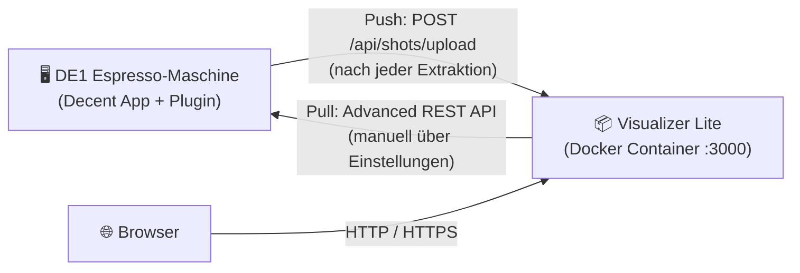
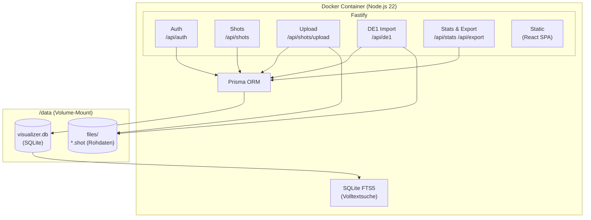
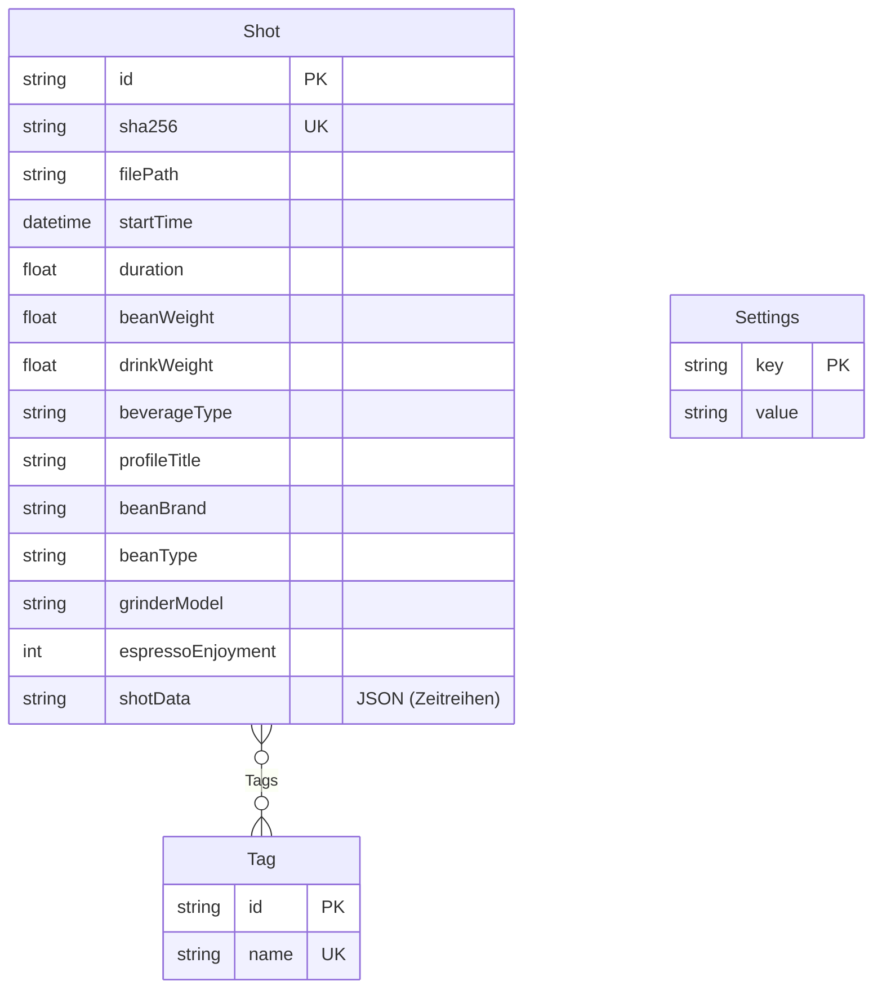

# Visualizer Lite

Selbst gehostete Espresso-Shot-Verwaltung für die [Decent Espresso DE1](https://decentespresso.com/).  
Jeden Shot erfassen, Extraktionskurven analysieren, Geschmack bewerten und Muster in der gesamten Shot-Historie entdecken.

## Key Features

- **Direktimport (Pull)** — Shots direkt von der DE1-Maschine holen mit der [Advanced REST API](https://github.com/randomcoffeesnob/decent-advanced-rest-api)-Extension; kein Kabel, keine manuelle Dateiübertragung nötig
- **Automatischer Upload (Push)** — Shots werden nach jeder Extraktion automatisch hochgeladen über das aktualisierte *Upload to visualizer*-DE1-Plugin
- **Filterbare Shot-Liste** — Suche und Filter nach Röster, Bohne, Profil, Mahlwerk, Getränketyp, Datumsbereich und mehr
- **Statistik-Dashboard** — KPI-Kacheln mit Periodenvergleich (24h bis Gesamt), Top-Röster/Röstungen/Profile, konfigurierbarer Getränkefilter (Espresso vs. Filter)
- **Shot-Vergleich** — Zwei Shots überlagert oder nebeneinander mit Extraktionskurven und Kennzahlen-Diff
- **Self-Hosted, einzelner Container** — Läuft lokal oder auf einem NAS (Synology etc.) als einzelner Docker-Container mit SQLite; keine Cloud, kein Account, volle Datenkontrolle
  - ⚠️ Kein Multi-Tenant-Support — eine Instanz, ein Benutzer
  - ⚠️ Bewusst nicht mit der Decent/Kaffee-Community verbunden (kein Teilen, kein Leaderboard)
- **DE1-Tablet entlasten** — Nach dem Import in Visualizer Lite können die Shots von der DE1-Maschine gelöscht werden, damit die Decent App auf dem Tablet schneller startet

<table>
  <tr>
    <td align="center" width="33%">
      
      <br/><sub><b>Shot-Liste</b></sub>
    </td>
    <td align="center" width="33%">
      
      <br/><sub><b>Extraktionskurven</b></sub>
    </td>
    <td align="center" width="33%">
      
      <br/><sub><b>Einstellungen &amp; Import</b></sub>
    </td>
  </tr>
  <tr>
    <td align="center" width="50%" colspan="2">
      
      <br/><sub><b>Shot-Vergleich — Überlagerte Kurven</b></sub>
    </td>
    <td align="center" width="50%">
      
      <br/><sub><b>Shot-Vergleich — Getrennte Ansicht</b></sub>
    </td>
  </tr>
  <tr>
    <td align="center" width="100%" colspan="3">
      
      <br/><sub><b>Statistik-Dashboard — 6-Monats-Ansicht</b></sub>
    </td>
  </tr>
</table>

---

## Schnellstart

Kein Build nötig — einfach das veröffentlichte Image aus der GitHub Container Registry verwenden.

**HTTP (lokales Netzwerk):**
```bash
docker run -d \
  --name visualizer-lite \
  --restart unless-stopped \
  -p 3000:3000 \
  -v /volume1/docker/visualizer-lite/data:/data \
  -e VL_SESSION_SECRET="$(openssl rand -base64 48)" \
  -e VL_PASSWORD="dein-passwort" \
  ghcr.io/tomschmidtdev/visualizer-lite:latest
```

**macOS / Windows — HTTP (lokale Nutzung):**

macOS (Terminal):
```bash
docker run -d \
  --name visualizer-lite \
  --restart unless-stopped \
  -p 3000:3000 \
  -v "$HOME/visualizer-lite-data:/data" \
  -e VL_SESSION_SECRET="$(openssl rand -base64 48)" \
  -e VL_PASSWORD="dein-passwort" \
  ghcr.io/tomschmidtdev/visualizer-lite:latest
```

Windows (PowerShell):
```powershell
docker run -d `
  --name visualizer-lite `
  --restart unless-stopped `
  -p 3000:3000 `
  -v "$env:USERPROFILE\visualizer-lite-data:/data" `
  -e "VL_SESSION_SECRET=beliebigen-langen-zufallsstring-hier-eintragen" `
  -e "VL_PASSWORD=dein-passwort" `
  ghcr.io/tomschmidtdev/visualizer-lite:latest
```

Danach im Browser öffnen: http://localhost:3000

---

**HTTPS (mit Zertifikaten):**
```bash
docker run -d \
  --name visualizer-lite \
  --restart unless-stopped \
  -p 3443:3000 \
  -v /volume1/docker/visualizer-lite/data:/data \
  -v /volume1/docker/visualizer-lite/certs:/certs:ro \
  -e VL_SESSION_SECRET="$(openssl rand -base64 48)" \
  -e VL_PASSWORD="dein-passwort" \
  ghcr.io/tomschmidtdev/visualizer-lite:latest
```

---

## Build & Deployment

> Nur nötig, wenn das Image selbst gebaut werden soll (z.B. für lokale Entwicklung oder einen Fork).

### 1. Docker-Image bauen

Auf dem Entwickler-Rechner:

```bash
# Für lokale Nutzung (natives Platform)
docker build -t visualizer-lite:local .

# Für Synology NAS oder andere x86_64/amd64-Geräte (Cross-Compile von Apple Silicon)
docker build --platform linux/amd64 -t visualizer-lite:nas .
docker save visualizer-lite:nas | gzip > visualizer-lite.tar.gz
```

### 2. Übertragen und auf dem NAS laden

```bash
# Übertragen
scp visualizer-lite.tar.gz admin@<NAS-IP>:/volume1/docker/

# Auf dem NAS (via SSH)
docker load < /volume1/docker/visualizer-lite.tar.gz
mkdir -p /volume1/docker/visualizer-lite/data/files
chown -R 1000:1000 /volume1/docker/visualizer-lite/data
```

### 3. Container starten

```bash
docker run -d \
  --name visualizer-lite \
  --restart unless-stopped \
  -p 3000:3000 \
  -v /volume1/docker/visualizer-lite/data:/data \
  -e VL_SESSION_SECRET="$(openssl rand -base64 48)" \
  -e VL_PASSWORD="dein-passwort" \
  visualizer-lite:nas
```

---

## HTTP vs. HTTPS

| | HTTP | HTTPS |
|---|---|---|
| Zertifikat erforderlich | Nein | Ja |
| Geeignet für | Nur lokales Netzwerk | Internet / externer Zugriff |
| Port | 3000 | 3443 (oder beliebig) |

### HTTPS-Setup (optional)

Ein Zertifikatsverzeichnis mounten — die App aktiviert HTTPS automatisch:

```bash
docker run -d \
  --name visualizer-lite \
  --restart unless-stopped \
  -p 3443:3000 \
  -v /volume1/docker/visualizer-lite/data:/data \
  -v /volume1/docker/visualizer-lite/certs:/certs:ro \
  -e VL_SESSION_SECRET="$(openssl rand -base64 48)" \
  -e VL_PASSWORD="dein-passwort" \
  visualizer-lite:nas
```

Zertifikatsdateien ablegen unter:
```raw
/volume1/docker/visualizer-lite/certs/
├── fullchain.pem
└── privkey.pem
```

> **Synology-Tipp:** Zertifikat über *Systemsteuerung → Sicherheit → Zertifikat → Exportieren* herunterladen, dann `cat cert.pem chain.pem > fullchain.pem`.  
> Alternativ den eingebauten Reverse Proxy nutzen (*Systemsteuerung → Anmeldeportal → Erweitert*) – dann läuft der Container nur auf HTTP, HTTPS übernimmt Synology.

---

## Umgebungsvariablen

| Variable | Standard | Beschreibung |
|---|---|---|
| `VL_SESSION_SECRET` | — | **Pflicht.** Zufälliger String ≥ 32 Zeichen |
| `VL_PASSWORD` | — | Initiales Login-Passwort |
| `VL_USERNAME` | `admin` | Initialer Benutzername |
| `DATA_DIR` | `/data` | Datenbank und Shot-Dateien |
| `PORT` | `3000` | Listening-Port |
| `CERT_PATH` | `/certs/fullchain.pem` | TLS-Zertifikat (HTTPS aktiv, wenn vorhanden) |
| `KEY_PATH` | `/certs/privkey.pem` | Privater TLS-Schlüssel |

---

## DE1-Plugin

Den Ordner `de1app/de1plus/plugins/visualizer_upload/` nach `/de1plus/plugins/visualizer_upload/` auf das DE1-Tablet kopieren und die DE1-App neu starten.

**Plugin-Einstellungen:**

| Einstellung | HTTP (lokales Netzwerk) | HTTPS (externer Zugriff) |
|---|---|---|
| Visualizer URL | `http://192.168.1.100:3000` | `https://meine-domain.de:3443` |
| Protokoll | Kein Zertifikat erforderlich | Gültiges TLS-Zertifikat notwendig |
| Empfehlung | Nur Heimnetzwerk | Internet-erreichbare Installation |

- `http://` mit interner IP-Adresse verwenden für einfachen lokalen Zugriff ohne Zertifikate.
- `https://` mit Domain-Namen verwenden, wenn die Instanz aus dem Internet erreichbar ist.
- Das Plugin zeigt eine Warnung, wenn eine HTTP-URL konfiguriert wird (unsicher über das Internet).

---

## Architektur

### Systemübersicht

Visualizer Lite läuft als einzelner Docker-Container. Die DE1-Maschine kommuniziert in beide Richtungen mit ihm; der Browser greift über Port 3000 auf denselben Container zu.



### Container-Aufbau

Der Container startet einen einzelnen Node.js-Prozess. Fastify liefert sowohl die REST API als auch das vorcompilierte React-SPA über denselben Port aus. Alle Daten liegen auf dem gemounteten `/data`-Volume — keine externen Dienste notwendig.



### Datenimport

Es existieren zwei unabhängige Importwege — Push von der Maschine und Pull auf Abruf:

```mermaid
sequenceDiagram
    participant DE1 as DE1-Maschine
    participant Plugin as DE1-Plugin
    participant API as Visualizer API
    participant DB as SQLite

    rect rgb(30, 50, 40)
        note over Plugin,DB: Push (automatisch nach jedem Shot)
        Plugin->>API: POST /api/shots/upload\n(multipart .shot-Datei)
        API->>API: Parsen + SHA-256-Deduplizierung
        API->>DB: INSERT oder UPDATE Shot
        API-->>Plugin: 200 OK / 409 Duplikat
    end

    rect rgb(30, 40, 55)
        note over DE1,DB: Pull (manuell über Einstellungsseite)
        API->>DE1: GET /api/v2/shots (Advanced REST API)
        DE1-->>API: Liste der Shot-Dateinamen
        API->>API: Filterung nach Datumsbereich
        loop Jede Shot-Datei
            API->>DE1: GET /api/v2/shots/{dateiname}
            DE1-->>API: .shot-Dateiinhalt
            API->>API: Parsen + SHA-256-Deduplizierung
            API->>DB: INSERT oder UPDATE
            API-->>API: NDJSON-Fortschritt streamen
        end
    end
```



### Monorepo-Struktur

```
visualizer-lite/
├── packages/
│   ├── api/                  # Fastify Backend (Node.js)
│   │   ├── src/
│   │   │   ├── routes/       # auth, shots, upload, de1, stats, export, search
│   │   │   ├── services/     # shotService, searchService, de1Service, …
│   │   │   ├── parsers/      # decent.ts — .shot-Datei-Parser
│   │   │   └── plugins/      # auth (JWT + Cookie)
│   │   └── prisma/
│   │       └── schema.prisma # SQLite-Schema (Shot, Tag, Settings)
│   └── web/                  # React 19 + Vite 6 Frontend
│       └── src/
│           ├── pages/        # ShotList, ShotDetail, ShotEdit, Stats, …
│           ├── components/   # ShotCard, Pagination, SearchBar, …
│           └── api/client.ts # Typsicherer Fetch-Wrapper
├── de1app/                   # DE1 Tcl-Plugin (Push-Upload)
└── Dockerfile                # Multi-Stage: builder → runtime
```

### Datenmodell



---

## Entwicklung

```bash
# Installation
npm install
cd packages/api && npx prisma migrate dev

# Terminal 1 — API (Port 3000)
cd packages/api
VL_SESSION_SECRET="dev-secret-must-be-at-least-32-chars!" \
VL_PASSWORD=test \
npm run dev

# Terminal 2 — Web (Port 5173)
cd packages/web && npm run dev

# Tests
cd packages/api && npx vitest run
```
