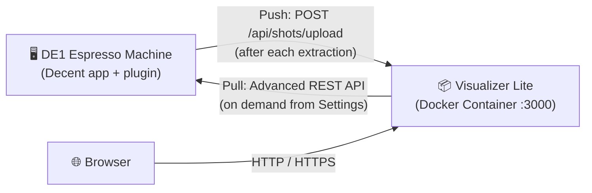
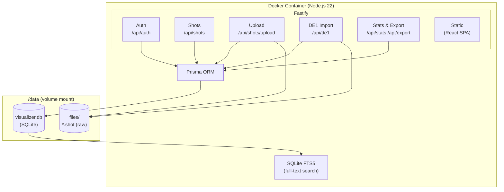
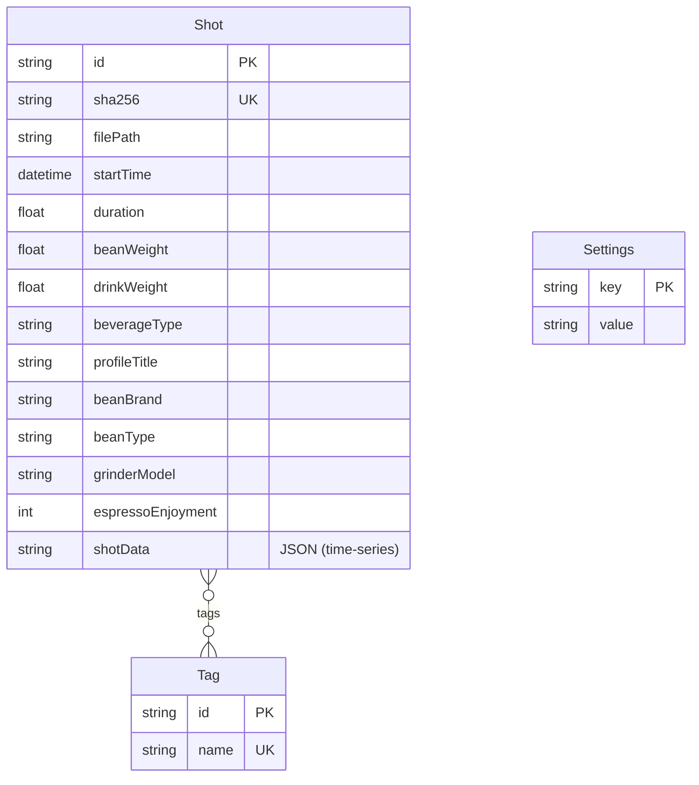

# Visualizer Lite

Self-hosted espresso shot manager for the [Decent Espresso DE1](https://decentespresso.com/).  
Track every shot, analyse extraction curves, rate taste, and discover patterns across your entire history.

## Key Features

- **Direct import (pull)** — fetch shots directly from the DE1 machine using the [Advanced REST API](https://github.com/randomcoffeesnob/decent-advanced-rest-api) extension; no cable or manual file transfer needed
- **Auto-upload (push)** — shots are pushed automatically after each extraction via the updated *Upload to visualizer* DE1 plugin
- **Filterable shot list** — search and filter by roaster, bean, profile, grinder, beverage type, date range, and more
- **Statistics dashboard** — KPI tiles with period comparison (24h to all-time), top roasters/roasts/profiles, configurable beverage filter (espresso vs. filter)
- **Shot comparison** — overlay or split two shots' extraction curves side by side with key metrics diff
- **Self-hosted, single container** — runs on a local machine or NAS (Synology etc.) as a single Docker container with SQLite; no cloud, no account, full data ownership
  - ⚠️ No multi-tenant support — one instance, one user
  - ⚠️ By design not connected to the broader Decent/coffee community (no sharing, no leaderboards)
- **Free up your DE1 tablet** — once shots are imported into Visualizer Lite, you can safely delete them from the DE1 machine, keeping the Decent app fast and responsive

<table>
  <tr>
    <td align="center" width="33%">
      
      <br/><sub><b>Shot List</b></sub>
    </td>
    <td align="center" width="33%">
      
      <br/><sub><b>Extraction Curves</b></sub>
    </td>
    <td align="center" width="33%">
      
      <br/><sub><b>Settings &amp; Import</b></sub>
    </td>
  </tr>
  <tr>
    <td align="center" width="50%" colspan="2">
      
      <br/><sub><b>Shot Comparison — Overlaid Curves</b></sub>
    </td>
    <td align="center" width="50%">
      
      <br/><sub><b>Shot Comparison — Split View</b></sub>
    </td>
  </tr>
  <tr>
    <td align="center" width="100%" colspan="3">
      
      <br/><sub><b>Statistics Dashboard — 6 Months View</b></sub>
    </td>
  </tr>
</table>

---

## Quick Start

No build required — use the published image from GitHub Container Registry.

**HTTP (local network):**
```bash
docker run -d \
  --name visualizer-lite \
  --restart unless-stopped \
  -p 3000:3000 \
  -v /volume1/docker/visualizer-lite/data:/data \
  -e VL_SESSION_SECRET="$(openssl rand -base64 48)" \
  -e VL_PASSWORD="your-password" \
  ghcr.io/tomschmidtdev/visualizer-lite:latest
```

**macOS / Windows — HTTP (local use):**

macOS (Terminal):
```bash
docker run -d \
  --name visualizer-lite \
  --restart unless-stopped \
  -p 3000:3000 \
  -v "$HOME/visualizer-lite-data:/data" \
  -e VL_SESSION_SECRET="$(openssl rand -base64 48)" \
  -e VL_PASSWORD="your-password" \
  ghcr.io/tomschmidtdev/visualizer-lite:latest
```

Windows (PowerShell):
```powershell
docker run -d `
  --name visualizer-lite `
  --restart unless-stopped `
  -p 3000:3000 `
  -v "$env:USERPROFILE\visualizer-lite-data:/data" `
  -e "VL_SESSION_SECRET=insert-any-long-random-string-here" `
  -e "VL_PASSWORD=your-password" `
  ghcr.io/tomschmidtdev/visualizer-lite:latest
```

Open http://localhost:3000 in your browser.

---

**HTTPS (with certificates):**
```bash
docker run -d \
  --name visualizer-lite \
  --restart unless-stopped \
  -p 3443:3000 \
  -v /volume1/docker/visualizer-lite/data:/data \
  -v /volume1/docker/visualizer-lite/certs:/certs:ro \
  -e VL_SESSION_SECRET="$(openssl rand -base64 48)" \
  -e VL_PASSWORD="your-password" \
  ghcr.io/tomschmidtdev/visualizer-lite:latest
```

---

## Build & Deploy

> Only needed if you want to build the image yourself (e.g. for local development or a fork).

### 1. Build the Docker image

On your development machine:

```bash
# For local use (native platform)
docker build -t visualizer-lite:local .

# For Synology NAS or any other x86_64/amd64 device (cross-compile from Apple Silicon)
docker build --platform linux/amd64 -t visualizer-lite:nas .
docker save visualizer-lite:nas | gzip > visualizer-lite.tar.gz
```

### 2. Transfer and load on the NAS

```bash
# Transfer
scp visualizer-lite.tar.gz admin@<NAS-IP>:/volume1/docker/

# On the NAS (via SSH)
docker load < /volume1/docker/visualizer-lite.tar.gz
mkdir -p /volume1/docker/visualizer-lite/data/files
chown -R 1000:1000 /volume1/docker/visualizer-lite/data
```

### 3. Start the container

```bash
docker run -d \
  --name visualizer-lite \
  --restart unless-stopped \
  -p 3000:3000 \
  -v /volume1/docker/visualizer-lite/data:/data \
  -e VL_SESSION_SECRET="$(openssl rand -base64 48)" \
  -e VL_PASSWORD="your-password" \
  visualizer-lite:nas
```

---

## HTTP vs. HTTPS

| | HTTP | HTTPS |
|---|---|---|
| Certificate required | No | Yes |
| Suitable for | Local network only | Internet / external access |
| Port | 3000 | 3443 (or any) |

### HTTPS setup (optional)

Mount a certificate directory and the app activates HTTPS automatically:

```bash
docker run -d \
  --name visualizer-lite \
  --restart unless-stopped \
  -p 3443:3000 \
  -v /volume1/docker/visualizer-lite/data:/data \
  -v /volume1/docker/visualizer-lite/certs:/certs:ro \
  -e VL_SESSION_SECRET="$(openssl rand -base64 48)" \
  -e VL_PASSWORD="your-password" \
  visualizer-lite:nas
```

Place your certificate files at:
```raw
/volume1/docker/visualizer-lite/certs/
├── fullchain.pem
└── privkey.pem
```

> **Synology tip:** Export the DSM certificate via *Control Panel → Security → Certificate → Export*, then `cat cert.pem chain.pem > fullchain.pem`.  
> Alternatively use Synology's built-in Reverse Proxy (*Control Panel → Login Portal → Advanced*) to handle HTTPS externally and run the container on plain HTTP.

---

## Environment Variables

| Variable | Default | Description |
|---|---|---|
| `VL_SESSION_SECRET` | — | **Required.** Random string ≥ 32 chars |
| `VL_PASSWORD` | — | Initial login password |
| `VL_USERNAME` | `admin` | Initial username |
| `DATA_DIR` | `/data` | Database and shot file storage |
| `PORT` | `3000` | Listening port |
| `CERT_PATH` | `/certs/fullchain.pem` | TLS certificate (HTTPS active when present) |
| `KEY_PATH` | `/certs/privkey.pem` | TLS private key |

---

## DE1 Plugin

Copy `de1app/de1plus/plugins/visualizer_upload/` to `/de1plus/plugins/visualizer_upload/` on the DE1 tablet, then restart the DE1 app.

**Plugin settings:**

| Setting | HTTP (local network) | HTTPS (external access) |
|---|---|---|
| Visualizer URL | `http://192.168.1.100:3000` | `https://my-domain.com:3443` |
| Protocol | No certificate needed | Valid TLS certificate required |
| Recommendation | Home use only | Internet-accessible setup |

- Use `http://` with an internal IP address for simple local-network access without certificates.
- Use `https://` with a domain name when the instance is reachable from the internet.
- The plugin shows a warning if you configure an HTTP URL (insecure over the internet).

---

## Architecture

### System Overview

Visualizer Lite runs as a single Docker container. The DE1 machine communicates with it in both directions; the browser accesses the same container on port 3000.



### Container Internals

The container runs a single Node.js process. Fastify serves both the REST API and the pre-built React SPA from the same port. Data is stored entirely on the mounted `/data` volume — no external services required.



### Data Ingestion

Two independent import paths exist — push from the machine and pull on demand:

```mermaid
sequenceDiagram
    participant DE1 as DE1 Machine
    participant Plugin as DE1 Plugin
    participant API as Visualizer API
    participant DB as SQLite

    rect rgb(30, 50, 40)
        note over Plugin,DB: Push (automatic after each shot)
        Plugin->>API: POST /api/shots/upload\n(multipart .shot file)
        API->>API: Parse + SHA-256 dedup
        API->>DB: INSERT or UPDATE shot
        API-->>Plugin: 200 OK / 409 duplicate
    end

    rect rgb(30, 40, 55)
        note over DE1,DB: Pull (manual, via Settings page)
        API->>DE1: GET /api/v2/shots (Advanced REST API)
        DE1-->>API: Shot filename list
        API->>API: Filter by date range
        loop Each shot file
            API->>DE1: GET /api/v2/shots/{filename}
            DE1-->>API: .shot file content
            API->>API: Parse + SHA-256 dedup
            API->>DB: INSERT or UPDATE
            API-->>API: Stream NDJSON progress
        end
    end
```



### Monorepo Structure

```
visualizer-lite/
├── packages/
│   ├── api/                  # Fastify backend (Node.js)
│   │   ├── src/
│   │   │   ├── routes/       # auth, shots, upload, de1, stats, export, search
│   │   │   ├── services/     # shotService, searchService, de1Service, …
│   │   │   ├── parsers/      # decent.ts — .shot file parser
│   │   │   └── plugins/      # auth (JWT + cookie)
│   │   └── prisma/
│   │       └── schema.prisma # SQLite schema (Shot, Tag, Settings)
│   └── web/                  # React 19 + Vite 6 frontend
│       └── src/
│           ├── pages/        # ShotList, ShotDetail, ShotEdit, Stats, …
│           ├── components/   # ShotCard, Pagination, SearchBar, …
│           └── api/client.ts # Typed fetch wrapper
├── de1app/                   # DE1 Tcl plugin (push upload)
└── Dockerfile                # Multi-stage: builder → runtime
```

### Data Model



---

## Development

```bash
# Install
npm install
cd packages/api && npx prisma migrate dev

# Terminal 1 — API (port 3000)
cd packages/api
VL_SESSION_SECRET="dev-secret-must-be-at-least-32-chars!" \
VL_PASSWORD=test \
npm run dev

# Terminal 2 — Web (port 5173)
cd packages/web && npm run dev

# Tests
cd packages/api && npx vitest run
```
