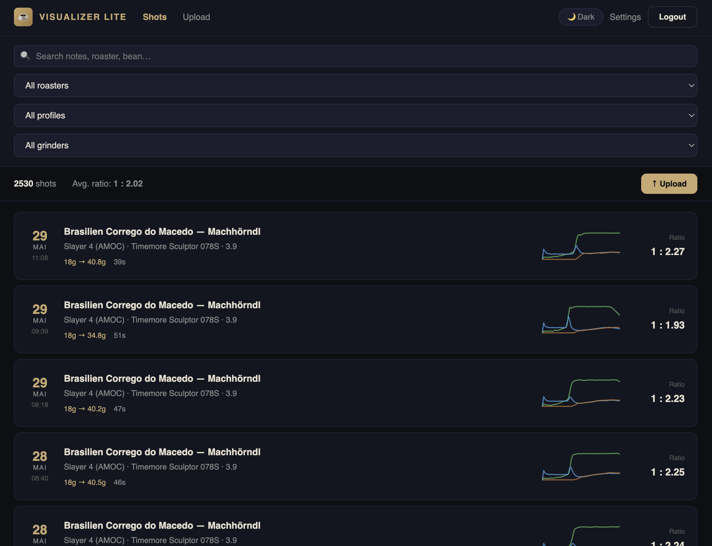
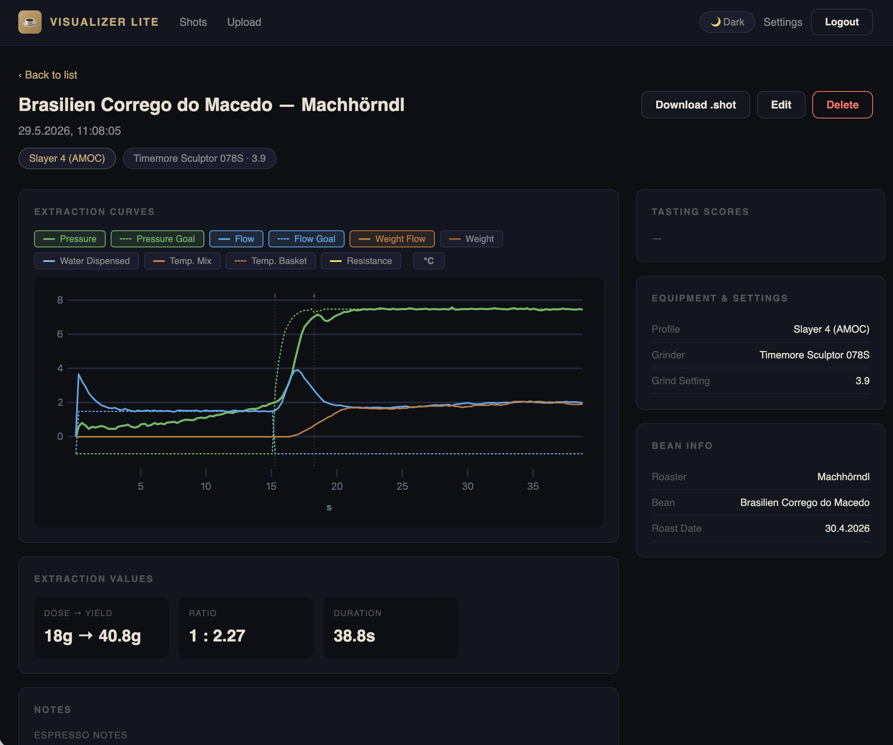
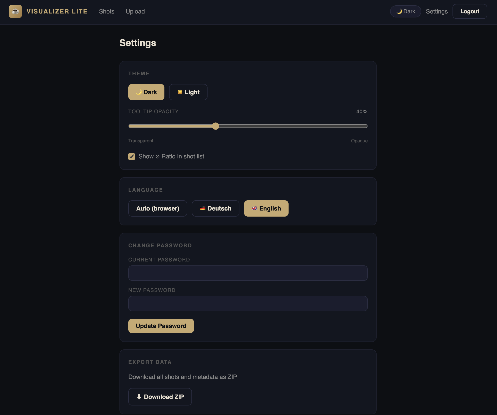
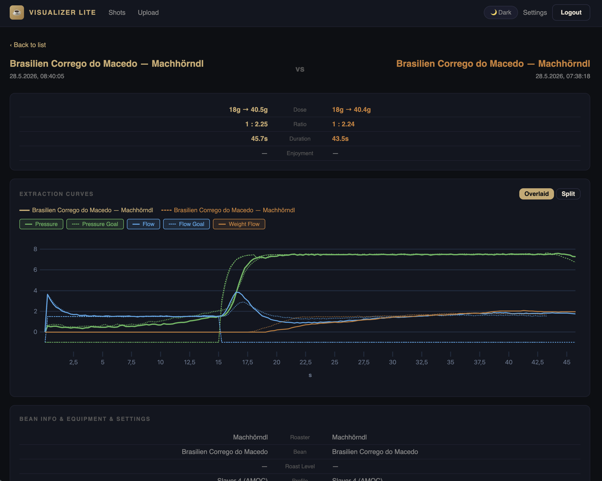
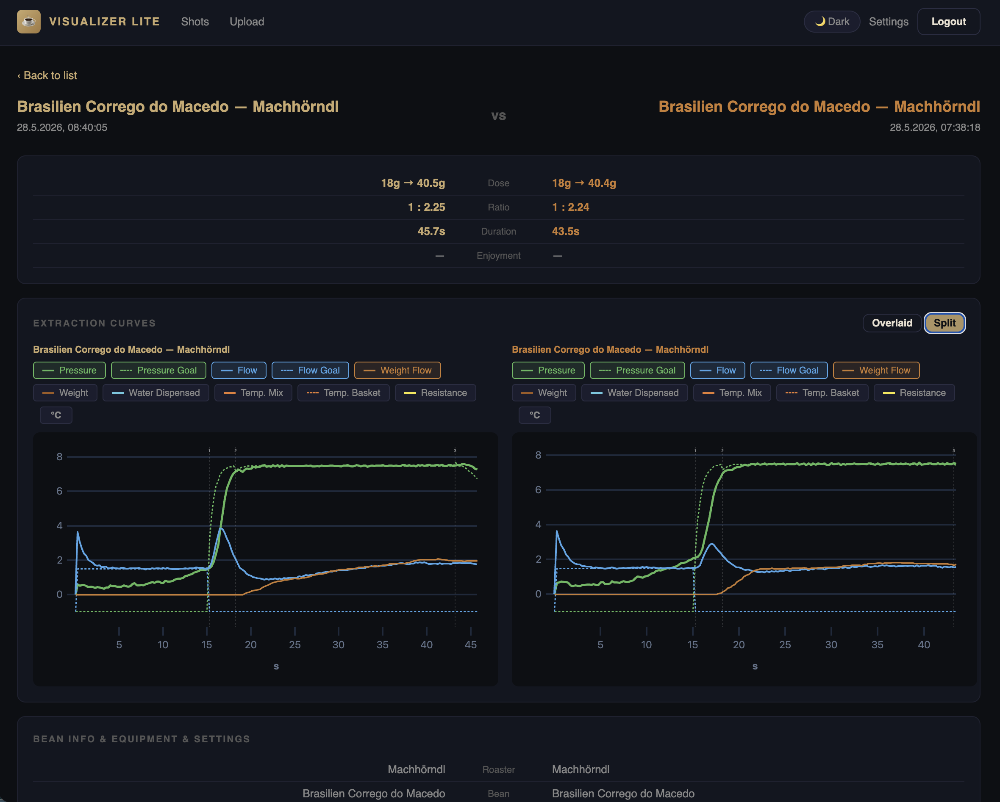
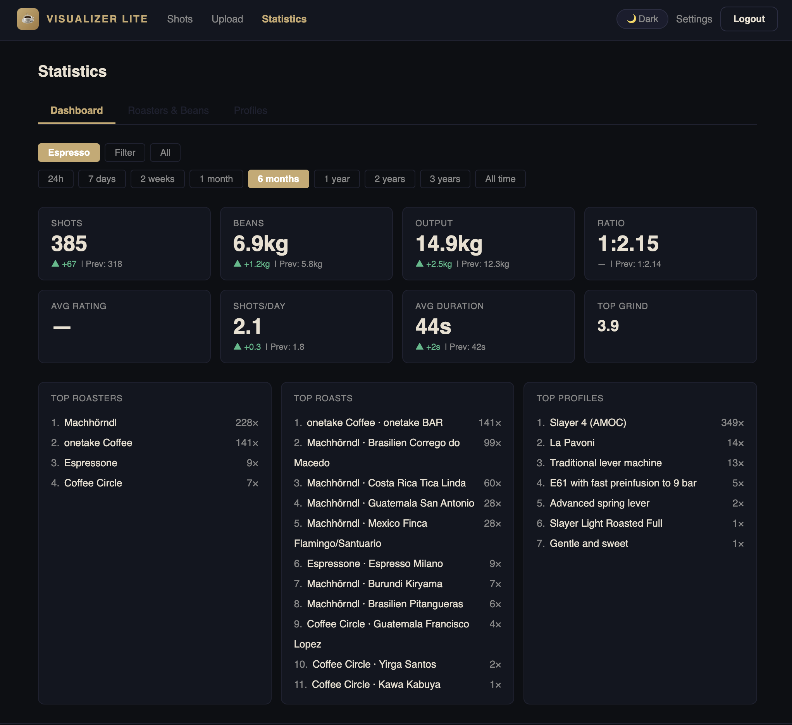
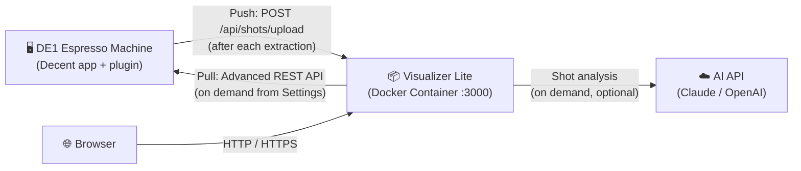
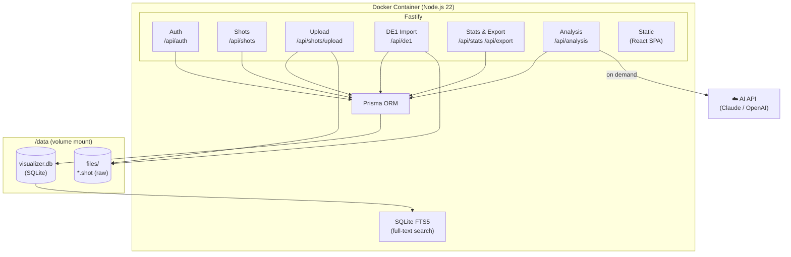
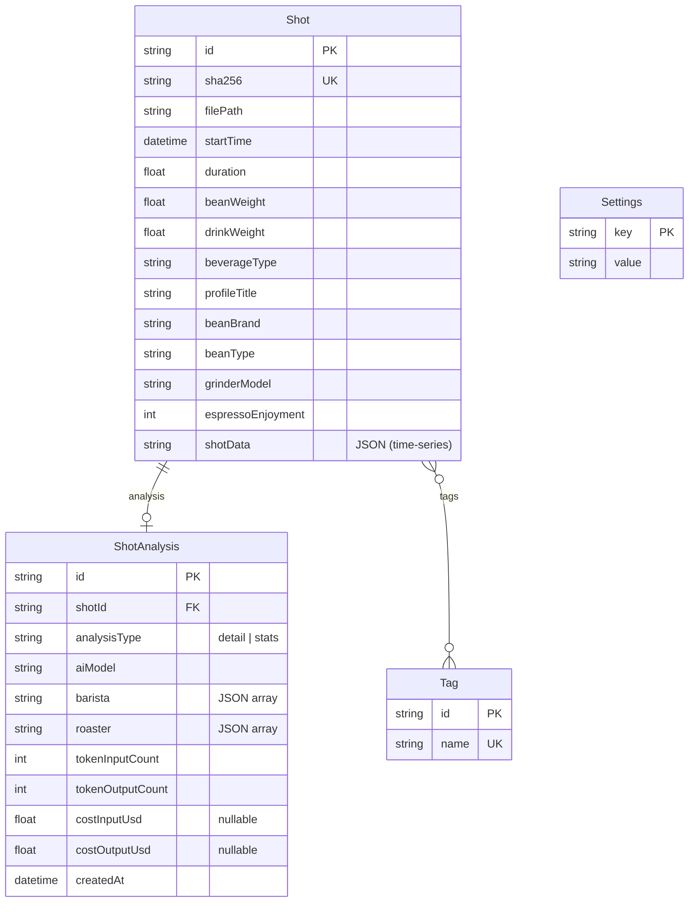

# Visualizer Lite

Self-hosted espresso shot manager for the [Decent Espresso DE1](https://decentespresso.com/). Track every shot, analyse extraction curves, compare profiles, and discover patterns across your entire brewing history — stored locally, owned entirely by you.

---

## Why Visualizer Lite?

The Decent DE1 is an exceptional espresso machine — but the Decent app on the tablet accumulates shot data over the years, and a large history slows it down. I wanted to archive shots off the tablet, keep them permanently accessible, and analyse them on my own terms.

Visualizer Lite grew out of that need:

- **Data ownership** — all data stays local; no cloud account, no external service dependency
- **Full history** — browse, filter, and compare shots across years, not just recent ones
- **Tablet performance** — once shots are imported, you can delete them from the DE1 machine, keeping the Decent app fast and responsive
- **Extensibility** — the data is yours; export it, analyse it, query it directly
- **A good side project** — honestly, building it has been fun

## Key Features

- **Direct import (pull)** — fetch shots directly from the DE1 machine using the [Advanced REST API](https://github.com/randomcoffeesnob/decent-advanced-rest-api) extension; no cable or manual file transfer needed
- **Auto-upload (push)** — shots are pushed automatically after each extraction via the modified [*Upload to visualizer*](de1app/de1plus/plugins/visualizer_upload/) DE1 plugin included in this repo
- **Manual upload** — drag-and-drop or file-picker upload of `.shot` files via the web interface
- **Export** — download your entire shot archive as a ZIP file for backup or external analysis
- **Filterable shot list** — search and filter by roaster, bean, profile, grinder, beverage type, and more
- **Statistics dashboard** — KPI tiles with period comparison (24h to all-time), top roasters/roasts/profiles, configurable beverage filter (espresso vs. filter); includes **Roasters & Beans** and **Profiles** tabs with sortable metrics tables
- **Shot comparison** — overlay or split two shots' extraction curves side by side with key metrics diff
- **AI analysis (experimental, for fun)** — on-demand shot analysis via Claude or OpenAI: **Barista** perspective (brewing technique, grind, tamping) and **Röster** perspective (bean, roast level, freshness); phase-aware with stable sub-phase detection; bring your own API key. Results are interesting but not authoritative — best results with **Claude Sonnet**. Each analysis records creation date, model, token counts and USD cost (fetched from OpenRouter, stored permanently so costs remain accurate even if prices change later)
- **Self-hosted, single container** — runs on a local machine or NAS (Synology etc.) as a single Docker container with SQLite; no cloud, no account, full data ownership
  - ⚠️ No multi-tenant support — one instance, one user
  - ⚠️ By design not connected to the broader Decent/coffee community (no sharing, no leaderboards)
- **Free up your DE1 tablet** — once shots are imported into Visualizer Lite, you can safely delete them from the DE1 machine, keeping the Decent app fast and responsive

<table>
  <tr>
    <td align="center" width="33%">
      
      <br/><sub><b>Shot List</b></sub>
    </td>
    <td align="center" width="33%">
      
      <br/><sub><b>Extraction Curves</b></sub>
    </td>
    <td align="center" width="33%">
      
      <br/><sub><b>Settings &amp; Import</b></sub>
    </td>
  </tr>
  <tr>
    <td align="center" width="33%">
      
      <br/><sub><b>Shot Comparison — Overlaid Curves</b></sub>
    </td>
    <td align="center" width="33%">
      
      <br/><sub><b>Shot Comparison — Split View</b></sub>
    </td>
    <td align="center" width="33%">
      
      <br/><sub><b>Statistics Dashboard — 6 Months View</b></sub>
    </td>
  </tr>
</table>

---

## Quick Start

No build required — use the published image from GitHub Container Registry.

**HTTP (local network):**
```bash
docker run -d \
  --name visualizer-lite \
  --restart unless-stopped \
  -p 3000:3000 \
  -v /volume1/docker/visualizer-lite/data:/data \
  -e VL_SESSION_SECRET="$(openssl rand -base64 48)" \
  -e VL_PASSWORD="your-password" \
  ghcr.io/tomschmidtdev/visualizer-lite:latest
```

> **Parameter explanation:**
>
> | Parameter | What to change |
> |---|---|
> | `-v /volume1/docker/visualizer-lite/data:/data` | The path **left of the colon** is where data is stored on your host machine. Change it to any directory you prefer (e.g. `/home/user/visualizer-data`). The `/data` on the right must stay as-is. |
> | `VL_SESSION_SECRET` | A long random string used to sign login sessions. Generate one with `openssl rand -base64 48` or use any password manager. **Keep it secret and consistent** — changing it logs out all active sessions. |
> | `VL_PASSWORD` | Your login password. Choose something strong if the instance is reachable outside your home network. Can be changed later in the app settings. |
> | `-p 3000:3000` | The port used to access the app (left side). Change to e.g. `-p 8080:3000` if port 3000 is already in use on your machine. |

**macOS / Windows — HTTP (local use):**

macOS (Terminal):
```bash
docker run -d \
  --name visualizer-lite \
  --restart unless-stopped \
  -p 3000:3000 \
  -v "$HOME/visualizer-lite-data:/data" \
  -e VL_SESSION_SECRET="$(openssl rand -base64 48)" \
  -e VL_PASSWORD="your-password" \
  ghcr.io/tomschmidtdev/visualizer-lite:latest
```

Windows (PowerShell):
```powershell
docker run -d `
  --name visualizer-lite `
  --restart unless-stopped `
  -p 3000:3000 `
  -v "$env:USERPROFILE\visualizer-lite-data:/data" `
  -e "VL_SESSION_SECRET=insert-any-long-random-string-here" `
  -e "VL_PASSWORD=your-password" `
  ghcr.io/tomschmidtdev/visualizer-lite:latest
```

Open http://localhost:3000 in your browser.

---

> **When do you need HTTPS?**
> If you only access Visualizer Lite from within your home network — the same network as both the DE1 and any device you use to access the app — plain HTTP is fine. Traffic never leaves your network. Only add HTTPS if you want to access the app from outside (mobile data, office, VPN). In that case, mount a certificate directory as shown below, or place a reverse proxy (e.g. Nginx Proxy Manager, Synology's built-in reverse proxy) in front of the container and run it on plain HTTP internally.

**HTTPS (with certificates):**
```bash
docker run -d \
  --name visualizer-lite \
  --restart unless-stopped \
  -p 3443:3000 \
  -v /volume1/docker/visualizer-lite/data:/data \
  -v /volume1/docker/visualizer-lite/certs:/certs:ro \
  -e VL_SESSION_SECRET="$(openssl rand -base64 48)" \
  -e VL_PASSWORD="your-password" \
  ghcr.io/tomschmidtdev/visualizer-lite:latest
```

---

## HTTP vs. HTTPS

| | HTTP | HTTPS |
|---|---|---|
| Certificate required | No | Yes |
| Suitable for | Local network only | Internet / external access |
| Port | 3000 | 3443 (or any) |

### HTTPS setup (optional)

Mount a certificate directory and the app activates HTTPS automatically:

```bash
docker run -d \
  --name visualizer-lite \
  --restart unless-stopped \
  -p 3443:3000 \
  -v /volume1/docker/visualizer-lite/data:/data \
  -v /volume1/docker/visualizer-lite/certs:/certs:ro \
  -e VL_SESSION_SECRET="$(openssl rand -base64 48)" \
  -e VL_PASSWORD="your-password" \
  visualizer-lite:nas
```

Place your certificate files at:
```raw
/volume1/docker/visualizer-lite/certs/
├── fullchain.pem
└── privkey.pem
```

> **Synology tip:** Export the DSM certificate via *Control Panel → Security → Certificate → Export*, then `cat cert.pem chain.pem > fullchain.pem`.  
> Alternatively use Synology's built-in Reverse Proxy (*Control Panel → Login Portal → Advanced*) to handle HTTPS externally and run the container on plain HTTP.

---

## Environment Variables

| Variable | Default | Description |
|---|---|---|
| `VL_SESSION_SECRET` | — | **Required.** Random string ≥ 32 chars |
| `VL_PASSWORD` | — | Initial login password |
| `VL_USERNAME` | `admin` | Initial username |
| `DATA_DIR` | `/data` | Database and shot file storage |
| `PORT` | `3000` | Listening port |
| `CERT_PATH` | `/certs/fullchain.pem` | TLS certificate (HTTPS active when present) |
| `KEY_PATH` | `/certs/privkey.pem` | TLS private key |

---

## Importing Shots

There are three ways to get shots into Visualizer Lite:

### Auto-push (recommended)

Once the *Upload to Visualizer* plugin is installed and configured, shots are uploaded automatically after every extraction — nothing else to do.

### Direct import from the DE1 machine

Requires the [Advanced REST API](https://github.com/randomcoffeesnob/decent-advanced-rest-api) plugin to be installed on the tablet.

Open **Settings → DE1 Import** in Visualizer Lite, set a date range, and start the import. The app streams results live and saves the date of the last successful import — next time you open the settings, the start date is pre-filled, so triggering a catch-up import is just one click.

> **Using Visualizer Lite alongside the official Visualizer:** If you use direct import instead of auto-push, the *Upload to Visualizer* plugin on the tablet can continue uploading to [visualizer.coffee](https://visualizer.coffee) as usual — the two are completely independent. This means you can run both services in parallel: the community features of visualizer.coffee and your local history in Visualizer Lite.

Useful for: initial bulk import of an existing shot history, catching up after the push plugin was temporarily not running, or when you prefer to keep the official Visualizer as your primary upload target.

### Manual upload

In the top navigation bar, use the upload button to select one or more `.shot` files from your computer. Duplicate detection (SHA-256) prevents the same shot from being stored twice, regardless of how it was imported.

---

## DE1 Plugins

Two plugins work together to connect the DE1 machine to Visualizer Lite:

### 1. Upload to Visualizer *(included in this repo — modified version)*

This plugin handles **automatic push uploads**: after every extraction, the DE1 app sends the `.shot` file to Visualizer Lite in the background.

It is based on the original [*Upload to Visualizer*](https://github.com/decentespresso/de1app/tree/main/de1plus/plugins/visualizer_upload) plugin by Johanna Schander, which was designed to upload shots to [visualizer.coffee](https://visualizer.coffee). The version included here has been extended to support **custom upload targets** — allowing it to point to your own Visualizer Lite instance instead of the public service. It supports both **HTTPS** (recommended when accessible from outside your network) and **HTTP** (unencrypted — only suitable within a trusted local network, since credentials are transmitted in plaintext over HTTP).

**Install:** Copy `de1app/de1plus/plugins/visualizer_upload/` to `/de1plus/plugins/visualizer_upload/` on the DE1 tablet and restart the DE1 app. In the plugin settings, enter your Visualizer Lite URL and credentials.

| Setting | HTTP (local network) | HTTPS (external access) |
|---|---|---|
| Visualizer URL | `http://192.168.1.100:3000` | `https://my-domain.com:3443` |
| Protocol | No certificate needed | Valid TLS certificate required |
| Recommendation | Home use only | Internet-accessible setup |

- Use `http://` with an internal IP address for simple local-network access without certificates.
- Use `https://` with a domain name when the instance is reachable from the internet.
- The plugin shows a warning if you configure an HTTP URL for an internet-accessible instance.

### 2. Advanced REST API *(external — required for direct import)*

The [Advanced REST API](https://github.com/randomcoffeesnob/decent-advanced-rest-api) extension is a separate community plugin that exposes a REST interface on the DE1 machine. Visualizer Lite uses this interface for **pull-based import**: you can trigger a bulk import of shots directly from the Visualizer Lite settings page, without any manual file transfer.

**Install:** Follow the instructions in the [Advanced REST API repository](https://github.com/randomcoffeesnob/decent-advanced-rest-api). This plugin is only required if you want to use the direct import feature.

---

## Related Links

- [Decent Espresso](https://decentespresso.com) — official website
- [Decent Espresso on GitHub](https://github.com/decentespresso)
- [Decent Diaspora on Basecamp](https://3.basecamp.com/3671212/projects/7351439) *(registration required)*
- [Visualizer](https://visualizer.coffee) — the official community shot visualizer
- [Visualizer on GitHub](https://github.com/miharekar/visualizer)
- [Upload to Visualizer plugin](https://github.com/decentespresso/de1app/tree/main/de1plus/plugins/visualizer_upload) — original plugin by Johanna Schander (basis for the modified version included here)
- [Advanced REST API plugin](https://github.com/randomcoffeesnob/decent-advanced-rest-api) — required for direct import

---

## Architecture

### System Overview

Visualizer Lite runs as a single Docker container. The DE1 machine communicates with it in both directions; the browser accesses the same container on port 3000. For AI analysis, the container calls external APIs (Claude or OpenAI) on demand — no API key is required for any other feature.



### Container Internals

The container runs a single Node.js process. Fastify serves both the REST API and the pre-built React SPA from the same port. Data is stored entirely on the mounted `/data` volume — no external services required.



### Data Ingestion

Two independent import paths exist — push from the machine and pull on demand:

```mermaid
sequenceDiagram
    participant DE1 as DE1 Machine
    participant Plugin as DE1 Plugin
    participant API as Visualizer API
    participant DB as SQLite

    rect rgb(30, 50, 40)
        note over Plugin,DB: Push (automatic after each shot)
        Plugin->>API: POST /api/shots/upload\n(multipart .shot file)
        API->>API: Parse + SHA-256 dedup
        API->>DB: INSERT or UPDATE shot
        API-->>Plugin: 200 OK / 409 duplicate
    end

    rect rgb(30, 40, 55)
        note over DE1,DB: Pull (manual, via Settings page)
        API->>DE1: GET /api/v2/shots (Advanced REST API)
        DE1-->>API: Shot filename list
        API->>API: Filter by date range
        loop Each shot file
            API->>DE1: GET /api/v2/shots/{filename}
            DE1-->>API: .shot file content
            API->>API: Parse + SHA-256 dedup
            API->>DB: INSERT or UPDATE
            API-->>API: Stream NDJSON progress
        end
    end
```



### Monorepo Structure

```
visualizer-lite/
├── packages/
│   ├── api/                  # Fastify backend (Node.js)
│   │   ├── src/
│   │   │   ├── routes/       # auth, shots, upload, de1, stats, export, search, analysis
│   │   │   ├── services/     # shotService, searchService, de1Service, analysisService, …
│   │   │   ├── parsers/      # decent.ts — .shot file parser
│   │   │   └── plugins/      # auth (JWT + cookie)
│   │   └── prisma/
│   │       └── schema.prisma # SQLite schema (Shot, ShotAnalysis, Tag, Settings)
│   └── web/                  # React 19 + Vite 6 frontend
│       └── src/
│           ├── pages/        # ShotList, ShotDetail, ShotEdit, Stats, …
│           ├── components/   # ShotCard, Pagination, SearchBar, …
│           └── api/client.ts # Typed fetch wrapper
├── de1app/                   # DE1 Tcl plugin (push upload)
└── Dockerfile                # Multi-stage: builder → runtime
```

### Data Model



---

## Development

```bash
# Install
npm install
cd packages/api && npx prisma migrate dev

# Terminal 1 — API (port 3000)
cd packages/api
VL_SESSION_SECRET="dev-secret-must-be-at-least-32-chars!" \
VL_PASSWORD=test \
npm run dev

# Terminal 2 — Web (port 5173)
cd packages/web && npm run dev

# Tests
cd packages/api && npx vitest run
```

---

## Build & Deploy

> Only needed if you want to build the image yourself (e.g. for local development or a fork).

### 1. Build the Docker image

On your development machine:

```bash
# For local use (native platform)
docker build -t visualizer-lite:local .

# For Synology NAS or any other x86_64/amd64 device (cross-compile from Apple Silicon)
docker build --platform linux/amd64 -t visualizer-lite:nas .
docker save visualizer-lite:nas | gzip > visualizer-lite.tar.gz
```

### 2. Transfer and load on the NAS

```bash
# Transfer
scp visualizer-lite.tar.gz admin@<NAS-IP>:/volume1/docker/

# On the NAS (via SSH)
docker load < /volume1/docker/visualizer-lite.tar.gz
mkdir -p /volume1/docker/visualizer-lite/data/files
chown -R 1000:1000 /volume1/docker/visualizer-lite/data
```

### 3. Start the container

```bash
docker run -d \
  --name visualizer-lite \
  --restart unless-stopped \
  -p 3000:3000 \
  -v /volume1/docker/visualizer-lite/data:/data \
  -e VL_SESSION_SECRET="$(openssl rand -base64 48)" \
  -e VL_PASSWORD="your-password" \
  visualizer-lite:nas
```


---

## Disclaimer

Visualizer Lite is a personal hobby project, made available free of charge under the [Business Source License 1.1](LICENSE.md) for personal, non-commercial, and internal business purposes (including self-hosting). Use of this software is entirely at your own risk.

The software is provided **"as is"**, without warranty of any kind. The author provides no support and assumes no liability for damages of any kind arising from the use, inability to use, or misuse of this software — including but not limited to data loss, security incidents, or system failures. The full warranty disclaimer and license terms are set out in [LICENSE.md](LICENSE.md).

Each user is solely responsible for the security and integrity of their own systems and for any configuration decisions, including network exposure, authentication setup, and TLS configuration — particularly if the instance is accessible outside a trusted local network.
