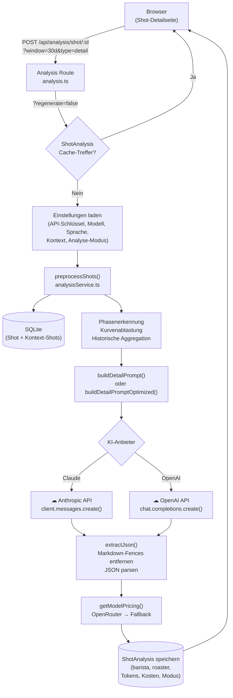
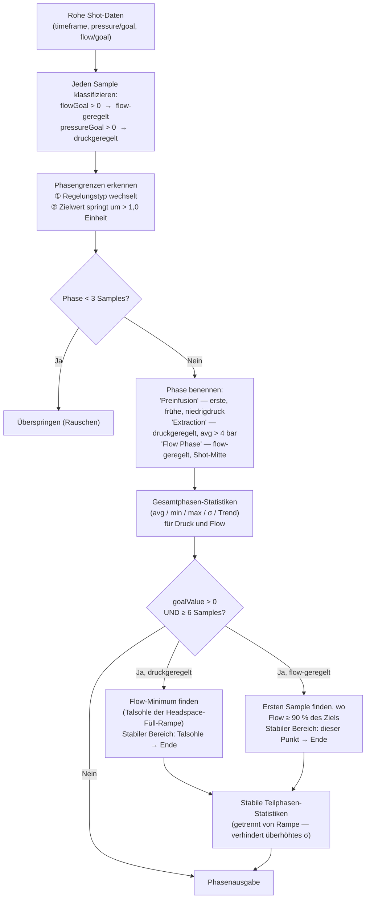
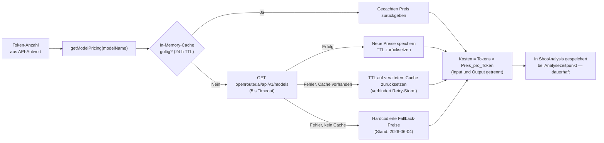

# KI-Shot-Analyse — Technische Referenz

Dieses Dokument beschreibt die vollständige Datenpipeline hinter der KI-Shot-Analyse: wie Rohdaten vorverarbeitet werden, wie Prompts zusammengestellt werden, was an die KI-API gesendet wird, welche Antwort erwartet wird und welche Optimierungen den Token-Verbrauch und die Kosten senken.

---

## Unterstützte Modelle

| Anbieter | Modell-IDs |
|----------|-----------|
| Anthropic | `claude-haiku-4-5-20251001`, `claude-sonnet-4-6`, `claude-opus-4-8` |
| OpenAI | `gpt-4o-mini`, `gpt-4o` |

Modell und API-Schlüssel werden pro Benutzer unter **Einstellungen → KI Analyse** konfiguriert. Der Anbieter wird aus dem Modellnamen abgeleitet (`gpt-*` → OpenAI, alles andere → Claude).

---

## Anfrageablauf



---

## Datenvorverarbeitung

### 1. Ziel-Shot

Der Shot wird mit allen Feldern aus SQLite geladen:

| Kategorie | Felder |
|----------|--------|
| Identität | `id`, `startTime` |
| Parameter | `beanWeight`, `drinkWeight`, `duration`, `drinkTds`, `drinkEy`, `espressoEnjoyment` |
| Bohne | `beanBrand`, `beanType`, `roastLevel`, `roastDate`, `beanNotes` |
| Equipment | `profileTitle`, `grinderModel`, `grinderSetting` |
| Tasting | `espressoNotes`, `acidity`, `sweetness`, `bitterness`, `mouthfeel`, `fragrance`, `aroma` |
| Sensorkurven | `espresso_pressure`, `espresso_pressure_goal`, `espresso_flow`, `espresso_flow_goal`, `espresso_temperature_mix`, `espresso_temperature_basket`, `espresso_flow_weight`, `timeframe` |

### 2. Kontextfenster

Bis zu **100 aktuelle Shots** vor dem Ziel-Shot werden innerhalb eines konfigurierbaren Zeitfensters (7 T, 30 T, 90 T, alle) geladen. Sie dienen **ausschließlich** der Berechnung historischer Basislinienwerte — sie werden nicht direkt in den Benutzer-Prompt aufgenommen.

**Mehrstufiges Matching** stellt sicher, dass die Basislinie immer vergleichbar ist:

| Stufe | Bedingung | Bezeichnung im Prompt |
|------|-----------|-----------------|
| 1 — ideal | Gleicher `profileTitle` **und** gleicher `beanBrand` + `beanType` | `same profile & bean` |
| 2 — Fallback | Nur gleicher `profileTitle` | `same profile` |
| — | `profileTitle` ist null, oder weniger als 2 Treffer | kein historischer Abschnitt |

Vergleiche über verschiedene Profile hinweg sind bedeutungslos — ein Turbo-Shot (hoher Flow, niedriger Druck) und ein Blooming-Flow-Shot haben völlig unterschiedliche Basiskurven. Shots ohne gespeichertes Profil erzeugen keinen historischen Abschnitt im Prompt.

### 3. Kurvenuntersampling

Rohe Sensorkurven enthalten typischerweise **300–600 Datenpunkte** bei ~2 Hz für einen 30–60 s Shot. Vor der Analyse werden sie auf **50 Punkte** pro Kanal mittels linearer Interpolation unterabgetastet, wobei die Gesamtform erhalten bleibt.

Unterabgetastete Kanäle (alle auf 50 Punkte, zeitlich ausgerichtet via `timeframe`):
- `espresso_pressure` / `espresso_pressure_goal`
- `espresso_flow` / `espresso_flow_goal`
- `espresso_temperature_mix`
- `espresso_flow_weight`

> Die Phasenerkennung läuft auf den **vollaufgelösten** Daten. In den Prompt fließen nur die berechneten Statistiken (avg, min, max, σ, Trend) — keine Roharrays.

### 4. Phasenerkennung

Dies ist der zentrale Vorverarbeitungsschritt. Die rohen Sensordatenströme werden in benannte, annotierte Phasen umgewandelt, über die das Modell korrekt urteilen kann.



**Warum eine stabile Teilphase?**
Bei druckgeregelten Phasen ist der Flow während der Kopfraumfüllung und des Druckaufbaus vor der Puck-Sättigung niedrig. Diese Samples in die Standardabweichung einzubeziehen würde künstlich hohe σ-Werte und falsche Channeling-Warnungen erzeugen. Die stabile Teilphase beginnt am Flow-Minimum (Ende des Druckaufbaus) und nutzt nur das stationäre Extraktionsfenster.

**Phasenausgabe-Felder:**

```typescript
{
  name: string              // "Preinfusion" | "Extraction" | "Flow Phase" | …
  control: 'flow' | 'pressure'
  goalValue: number | null  // programmierter Zielwert (ml/s oder bar)
  startTime, endTime, durationS: number
  pressure: { avg, min, max, stdDev, tracking? }  // tracking = |Ist − Soll|
  flow:     { avg, min, max, stdDev, tracking? }
  tempAvg: number | null
  trend: 'stable' | 'rising' | 'falling' | 'peaked'
  stable?: {                // nur wenn eine stabile Teilphase gefunden wurde
    startTime, durationS
    pressure: { avg, min, max, stdDev }
    flow:     { avg, min, max, stdDev }
    tempAvg: number | null
    flowTrend: 'stable' | 'rising' | 'falling' | 'peaked'
  }
}
```

### 5. Scale-Flow-Analyse

`espresso_flow_weight` ist der Tassenwaagen-Output — 5–15 s verzögert gegenüber dem Maschinenflow, aber das eigentliche Extraktionssignal. Separat analysiert:

- **Zeitpunkt des ersten Tropfens** — wenn die Waage Flow erkennt (> 0,05 ml/s)
- **Maximaler Flow**
- **Spät-Shot-Durchschnitt** (letztes Drittel der Nicht-Null-Werte)
- **Residuale Instabilität** — Abweichung vom gleitenden 5-Punkte-Mittelwert. Erkennt Oszillationen (Channeling-Signal), ignoriert dabei normale steigende/fallende Trends. Als `UNSTABLE` markiert wenn residuales σ > 0,12 ml/s und der Trend weder rein steigend noch fallend ist.

### 6. Historische Aggregation

Aus den Kontext-Shots werden **Extraktionsphasen-Durchschnitte** berechnet (bevorzugt stabile Teilphasen-Statistiken, Fallback: Samples mit Druck > 4 bar). Im Prompt enthalten, wenn ≥ 2 Kontext-Shots vorhanden:

- Mittlerer Extraktionsdruck (bar)
- Mittlerer Extraktionsflow (ml/s)
- Mittlere Basket-Temperatur (°C, wenn verfügbar)

---

## Prompt-Aufbau

### System-Prompt

Der System-Prompt legt zwei Analyseperspektiven und die kritischen Regeln für die Interpretation der Sensordaten fest.

**Wesentliche Regeln in beiden Varianten:**

1. **Regelungs-Semantik** — Flow-geregelte Phase: Druck ist die *Ausgabe* (Puckwiderstand), kein Stabilitätsindikator. Druckgeregelte Phase: Flow ist die Ausgabe, Flow-Spitzen zeigen Channeling.
2. **Channeling-Schwelle** — nur in druckgeregelten Phasen markieren; σ-Schwelle unterscheidet sich je nach Modus (siehe Tabelle).
3. **Zielwerte sind maßgeblich** — `goal=X` ist der *tatsächliche programmierte* Zielwert, der nie durch Trainingswissen ersetzt werden darf.
4. **Keine erfundene Geschichte** — historische Vergleiche sind verboten, außer wenn eine "Verlauf"-Zeile im Prompt vorhanden ist.
5. **Nur JSON-Ausgabe** — `{"barista":[…],"roaster":[…]}`, 3–5 Einträge pro Array, konkrete Datenbezüge.

#### Standard-System-Prompt (~850 Tokens)

Detaillierte Markdown-Prosa. Jede Regel ausführlich mit Beispielen erklärt. Enthält das `[HIGH — channeling?]`-Label im Benutzer-Prompt für Flow σ > 0,15 ml/s.

#### Optimierter System-Prompt (~350 Tokens, −60 %)

Gleichwertige Regeln in kompakter Aufzählungsform. Keine Markdown-Überschriften, keine Beispiele, keine „CRITICAL"-Callouts. Channeling erfordert *sowohl* σ > 0,20 ml/s *als auch* einen plötzlichen Spike (strenger, weniger Fehlalarme).

---

### Benutzer-Prompt — Standard-Modus

Markdown-formatierte Prosa. Typische Größe: **400–800 Tokens**.

```
## Shot Analysis

**Shot Date:** 2026-06-04
**Bean:** Gardelli · Ethiopia Wush Wush · Light
**Roast Date:** 2026-05-15 (20 days since roast)
**Parameters:** 18g → 36g (1:2.00) · 28.0s · TDS 9.2% · EY 22.1% · Score 82/100
**Profile:** Blooming Flow
**Grinder:** Timemore Sculptor 078S @ 12.0

### Profile Phases
**Preinfusion** (0.0–8.5s, 8.5s, flow-controlled, goal 2.0 ml/s)
  Stable (3.2–8.5s, 5.3s):
    Puck resistance (pressure output): avg=1.82 bar, min=0.4, max=3.1, trend=rising
    Flow (controlled): avg=1.94 ml/s, min=1.1, max=2.1, trend=stable
    Basket temp: 93.1°C

**Extraction** (8.5–30.2s, 21.7s, pressure-controlled, goal 9.0 bar)
  Ramp: 8.5–11.3s (pressure rising to goal)
  Stable extraction (11.3–30.2s, 18.9s):
    Pressure: avg=9.03 bar, min=8.7, max=9.3
    Flow: avg=1.82 ml/s, min=1.1, max=2.3, trend=falling
    Basket temp: 93.2°C

### Scale Flow (cup output)
- First drop at: 6.2s
- Peak: 2.41 ml/s, late avg: 1.78 ml/s, trend: falling

### Tasting
Notes: "slightly bitter finish" · Acidity 3 · Sweetness 4 · Bitterness 5 · Mouthfeel 3

### Historical Context (28 shots, same profile & bean, extraction-phase averages)
- Avg extraction pressure: 9.1 bar
- Avg extraction flow: 1.9 ml/s
- Avg basket temp: 93.2°C

### Machine & Setup Context
Machine: Decent Espresso DE1
[benutzerkonfigurierter Kontext aus den Einstellungen]
```

---

### Benutzer-Prompt — Optimierter Modus

Kompaktes Key=Value-Format. Typische Größe: **200–400 Tokens** (−50 %).

```
Shot 2026-06-04
Bean: Gardelli · Ethiopia Wush Wush · Light (20d post-roast)
Params: 18g→36g (1:2.0) · 28s · TDS 9.2% · EY 22.1% · Score 82/100
Setup: Blooming Flow | Timemore Sculptor 078S @12.0

### Phases
Preinfusion 0.0–8.5s | flow-ctrl goal=2.0ml/s
  stable 3.2–8.5s: pres=1.8 flow=1.9 trend=stable temp=93.1°C
Extraction 8.5–30.2s | pres-ctrl goal=9.0bar
  ramp 8.5–11.3s
  stable 11.3–30.2s: pres=9.0 flow=1.8 trend=falling temp=93.2°C

Scale flow: first-drop=6.2s peak=2.41ml/s late=1.8ml/s trend=falling

Tasting: "slightly bitter finish" · acid=3 · sweet=4 · bitter=5 · body=3
History (28 shots, same profile & bean): pres=9.1bar · flow=1.9ml/s · temp=93.2°C

Context: Machine: Decent Espresso DE1
[benutzerkonfigurierter Kontext]
```

> σ-Werte werden im optimierten Prompt weggelassen, sofern sie die Schwelle von 0,20 ml/s nicht überschreiten — reduziert Rauschen bei guten Shots.

---

## API-Anfrage

### Claude — Standard-Modus

```json
{
  "model": "claude-haiku-4-5-20251001",
  "max_tokens": 2048,
  "system": "<Standard-System-Prompt ~850 Tokens>",
  "messages": [
    { "role": "user", "content": "<Standard-Benutzer-Prompt ~400–800 Tokens>" }
  ]
}
```

### Claude — Optimierter Modus (mit Prompt Caching)

```json
{
  "model": "claude-haiku-4-5-20251001",
  "max_tokens": 1024,
  "system": [
    {
      "type": "text",
      "text": "<Optimierter System-Prompt ~350 Tokens>",
      "cache_control": { "type": "ephemeral" }
    }
  ],
  "messages": [
    { "role": "user", "content": "<Optimierter Benutzer-Prompt ~200–400 Tokens>" }
  ]
}
```

Die `cache_control: ephemeral`-Annotation weist die Anthropic-API an, den System-Prompt bis zu 5 Minuten zu cachen. Bei einem Cache-Treffer werden die System-Prompt-Tokens zu ~10 % des normalen Input-Token-Preises abgerechnet.

### OpenAI

```json
{
  "model": "gpt-4o-mini",
  "max_tokens": 2048,
  "response_format": { "type": "json_object" },
  "messages": [
    { "role": "system", "content": "<System-Prompt>" },
    { "role": "user",   "content": "<Benutzer-Prompt>" }
  ]
}
```

`response_format: json_object` erzwingt JSON-Ausgabe nativ, ohne allein auf die Prompt-Anweisung angewiesen zu sein. Prompt Caching wird für OpenAI nicht verwendet.

---

## Erwartete Antwort

Das Modell muss ein JSON-Objekt mit genau zwei Keys zurückgeben:

```json
{
  "barista": [
    "Der Mahlgrad erscheint etwas zu grob: Flow lag im stabilen Extraktionsbereich bei durchschnittlich 2,3 ml/s bei Ziel 9,0 bar. Einen Klick feiner auf der Timemore probieren.",
    "Die 8,5 s Vorbenetzung im Blooming-Flow erzielte eine gute Puck-Sättigung — Druckaufbau von 8,5–11,3 s ist sauber ohne Überschwingen."
  ],
  "roaster": [
    "Bei 20 Tagen nach der Röstung ist dieser helle Äthiopier past dem Ausgasungsmaximum. TDS 9,2 % bei 1:2-Ratio deutet auf leichte Unterextraktion hin — +0,5 °C oder feiner mahlen probieren.",
    "93 °C Basket-Temp passt gut zu einem hellen Röstgrad. Die leichte Bitterkeit spiegelt wahrscheinlich den Natural-Process-Charakter wider, nicht Überextraktion bei dieser Dauer."
  ]
}
```

3–5 Einträge pro Array. Jeder Eintrag muss konkrete Datenwerte und Phasennamen referenzieren. Der `analyst`-Key wurde aus UI und Prompts entfernt; er wird aus Datenbankschema-Kompatibilitätsgründen immer als leeres Array `[]` zurückgegeben.

**Extraktion-Fallback:** `extractJson()` entfernt vor dem Parsen alle Markdown-Code-Fences (` ```json … ``` `), um Modelle zu tolerieren, die diese trotz Anweisung hinzufügen.

---

## Optimierungen

### Übersicht

| | Standard | Optimiert |
|--|----------|-----------|
| System-Prompt | ~850 Tokens | ~350 Tokens (−60 %) |
| Benutzer-Prompt | ~400–800 Tokens | ~200–400 Tokens (−50 %) |
| `max_tokens` | 2 048 | 1 024 |
| Prompt Caching (Claude) | Nein | Ja — System-Prompt gecacht |
| Flow σ angezeigt bei | > 0,08 ml/s | > 0,20 ml/s |
| Channeling-Markierung | σ > 0,15 → `[HIGH]` | σ > 0,20 UND plötzlicher Spike |
| Geschätzte Kosten (Haiku, Cache-Miss) | ~$0,0003 | ~$0,00015 |
| Geschätzte Kosten (Haiku, Cache-Hit) | — | ~$0,00005 |

### Kompaktes Prompt-Format

Der optimierte Benutzer-Prompt verwendet Key=Value-Kurzschreibweise (`pres=9.0 flow=1.8`) anstelle von Markdown-Prosa (`Pressure: avg=9.03 bar, min=8.7, max=9.3`). Die Informationsdichte ist identisch; der Token-Verbrauch ist etwa halb so groß.

### Sigma-Unterdrückung

Im optimierten Modus wird Flow σ nur dann in den Prompt-Text aufgenommen, wenn er 0,20 ml/s überschreitet. Bei gut ausgeführten Shots verschwindet diese Zeile einfach, reduziert Rauschen und lässt Anomalien für das Modell deutlicher hervortreten.

### Stabile Teilphase (beide Modi)

Der Druckaufbau-Zeitraum druckgeregelter Phasen wird von allen dem Modell gemeldeten Statistiken ausgeschlossen. Ohne dies würde der natürliche Flow-Anstieg von 0 auf ~2 ml/s während der ersten 3–5 s der Extraktion σ aufblähen und falsche Channeling-Warnungen erzeugen.

### Rampen-/Stabil-Trennung

Bei druckgeregelten Phasen trennt der Prompt explizit die Rampenphase (`ramp 8.5–11.3s`) von der stabilen Extraktion, damit das Modell genau versteht, welches Zeitfenster die Statistiken abdecken.

### `max_tokens` halbiert

Der optimierte Antwort-Prompt plus System-Prompt beanspruchen weniger Tokens, und die erwartete Ausgabe (3–5 kurze Stichpunkte) benötigt selten mehr als 400 Output-Tokens. Die Halbierung von `max_tokens` von 2 048 auf 1 024 senkt die Kosten bei langen Antworten und verhindert seltene unkontrollierte Generierungen.

---

## Kostenverfolgung

Preise werden live von der OpenRouter-API abgerufen und im Speicher gecacht.



Fallback-Preise (USD pro Token):

| Modell | Input | Output |
|-------|-------|--------|
| claude-haiku-4-5 | $0,00000025 | $0,00000125 |
| claude-sonnet-4-6 | $0,000003 | $0,000015 |
| claude-opus-4-8 | $0,000005 | $0,000025 |
| gpt-4o-mini | $0,00000015 | $0,0000006 |
| gpt-4o | $0,0000025 | $0,000010 |

Kosten werden **zum Analysezeitpunkt** gespeichert. Historische Einträge bleiben korrekt, auch wenn sich Preise später ändern, da der Preis erfasst und nicht bei der Anzeige alter Analysen neu nachgeschlagen wird.

---

## Datenbankschema

```
ShotAnalysis {
  id               String    @id  @default(cuid())
  shotId           String    @unique          ← 1:1 mit Shot
  analysisType     String                     "detail" | "stats"
  aiModel          String                     verwendeter Modellname
  barista          String                     JSON-String string[]
  roaster          String                     JSON-String string[]
  analyst          String                     JSON-String string[] (immer [])
  tokenInputCount  Int
  tokenOutputCount Int
  costInputUsd     Float?                     null wenn Preis nicht verfügbar
  costOutputUsd    Float?
  analysisMode     String?                    "standard" | "optimized"
  createdAt        DateTime  @default(now())
}
```

---

## Analyse-Cache

Pro Shot wird eine `ShotAnalysis`-Zeile gespeichert (1:1-Beziehung). Bei nachfolgenden Anfragen für denselben Shot wird das gecachte Ergebnis sofort zurückgegeben, ohne die KI-API aufzurufen.

Der **Neu generieren**-Button auf der Shot-Detailseite sendet `?regenerate=true`, was die Cache-Prüfung umgeht und die gespeicherte Analyse mit einem frischen Ergebnis überschreibt.
