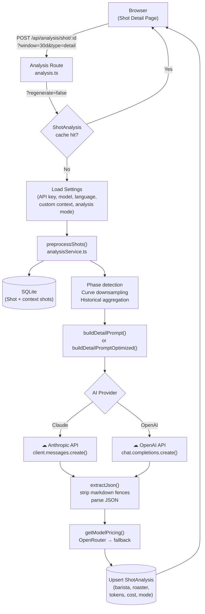
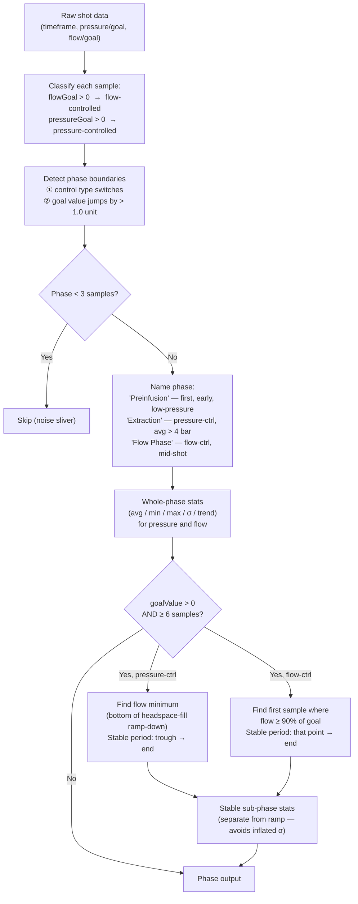
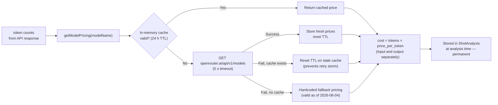

# AI Shot Analysis — Technical Reference

This document describes the complete data pipeline behind the AI shot analysis feature: how raw shot data is preprocessed, how prompts are assembled, what is sent to the AI API, what response is expected, and what optimisations reduce token consumption and cost.

---

## Supported Models

| Provider | Model IDs |
|----------|-----------|
| Anthropic | `claude-haiku-4-5-20251001`, `claude-sonnet-4-6`, `claude-opus-4-8` |
| OpenAI | `gpt-4o-mini`, `gpt-4o` |

The model and API key are configured per-user in **Settings → KI Analyse**. The provider is inferred from the model name (`gpt-*` → OpenAI, everything else → Claude).

---

## Request Flow



---

## Data Preprocessing

### 1. Target Shot

The shot is loaded from SQLite with all fields:

| Category | Fields |
|----------|--------|
| Identity | `id`, `startTime` |
| Parameters | `beanWeight`, `drinkWeight`, `duration`, `drinkTds`, `drinkEy`, `espressoEnjoyment` |
| Bean | `beanBrand`, `beanType`, `roastLevel`, `roastDate`, `beanNotes` |
| Equipment | `profileTitle`, `grinderModel`, `grinderSetting` |
| Tasting | `espressoNotes`, `acidity`, `sweetness`, `bitterness`, `mouthfeel`, `fragrance`, `aroma` |
| Sensor curves | `espresso_pressure`, `espresso_pressure_goal`, `espresso_flow`, `espresso_flow_goal`, `espresso_temperature_mix`, `espresso_temperature_basket`, `espresso_flow_weight`, `timeframe` |

### 2. Context Window

Up to **100 recent shots** preceding the target shot are loaded within a configurable time window (7 d, 30 d, 90 d, all). They are used **only** for historical baseline calculation — not included in the user prompt directly.

**Tiered matching** ensures the baseline is always comparable:

| Tier | Condition | Label in prompt |
|------|-----------|-----------------|
| 1 — ideal | Same `profileTitle` **and** same `beanBrand` + `beanType` | `same profile & bean` |
| 2 — fallback | Same `profileTitle` only | `same profile` |
| — | `profileTitle` is null, or fewer than 2 matches found | no historical context |

Comparing across different profiles is meaningless — a Turbo shot (high-flow, low-pressure) and a Blooming Flow shot have entirely different baseline curves. Shots with no profile stored produce no historical section in the prompt at all.

### 3. Curve Downsampling

Raw sensor curves typically contain **300–600 data points** at ~2 Hz for a 30–60 s shot. Before analysis they are downsampled to **50 points** per channel using linear interpolation, preserving the overall shape while keeping the payload small.

Downsampled channels (all to 50 points, kept time-aligned via `timeframe`):
- `espresso_pressure` / `espresso_pressure_goal`
- `espresso_flow` / `espresso_flow_goal`
- `espresso_temperature_mix`
- `espresso_flow_weight`

> Phase detection runs on the **full-resolution** data. Only the resulting statistics (avg, min, max, σ, trend) enter the prompt — no raw arrays.

### 4. Phase Detection

This is the central preprocessing step. It converts the raw sensor streams into named, annotated phases that the model can reason about correctly.



**Why a stable sub-phase?**
For pressure-controlled phases, flow is low during the headspace fill and ramp-up before the puck is saturated. Including those samples in the standard deviation would produce artificially high σ values and false channeling alerts. The stable sub-phase starts at the flow minimum (end of ramp-down) and uses only the steady extraction window.

**Phase output fields:**

```typescript
{
  name: string              // "Preinfusion" | "Extraction" | "Flow Phase" | …
  control: 'flow' | 'pressure'
  goalValue: number | null  // programmed target (ml/s or bar)
  startTime, endTime, durationS: number
  pressure: { avg, min, max, stdDev, tracking? }  // tracking = |actual − goal|
  flow:     { avg, min, max, stdDev, tracking? }
  tempAvg: number | null
  trend: 'stable' | 'rising' | 'falling' | 'peaked'
  stable?: {                // only when a stable sub-phase was found
    startTime, durationS
    pressure: { avg, min, max, stdDev }
    flow:     { avg, min, max, stdDev }
    tempAvg: number | null
    flowTrend: 'stable' | 'rising' | 'falling' | 'peaked'
  }
}
```

### 5. Scale Flow Analysis

`espresso_flow_weight` is the cup-scale output — delayed 5–15 s vs. machine flow, but the true extraction signal. Analysed separately:

- **First drop time** — when the scale detects flow (> 0.05 ml/s)
- **Peak flow rate**
- **Late-shot average** (last third of non-zero values)
- **Residual instability** — deviation from a 5-point moving average. This detects oscillations (channeling signal) while ignoring normal rising/falling trends. Marked `UNSTABLE` when residual σ > 0.12 ml/s and the trend is neither purely rising nor falling.

### 6. Historical Aggregation

From the context shots, **extraction-phase averages** are computed (using stable sub-phase stats where available, otherwise falling back to pressure > 4 bar samples). Included in the prompt only when ≥ 2 context shots exist:

- Mean extraction pressure (bar)
- Mean extraction flow (ml/s)
- Mean basket temperature (°C, when available)

---

## Prompt Construction

### System Prompt

The system prompt establishes two analysis perspectives and the critical rules for interpreting sensor data.

**Key rules encoded in both variants:**

1. **Control-type semantics** — flow-controlled phase: pressure is the *output* (puck resistance), not a stability metric. Pressure-controlled phase: flow is the output, flow spikes indicate channeling.
2. **Channeling threshold** — only flag in pressure-controlled phases; σ threshold differs by mode (see table below).
3. **Goal values are authoritative** — `goal=X` is the *actual programmed* target, never to be replaced by training-data intuition.
4. **No invented history** — forbidden to invent historical comparisons unless a "History" line is present in the prompt.
5. **JSON-only output** — `{"barista":[…],"roaster":[…]}`, 3–5 entries each, concrete data references.

#### Standard system prompt (~850 tokens)

Detailed markdown prose. Each rule explained verbatim with examples. Includes the `[HIGH — channeling?]` label in the user prompt for flow σ > 0.15 ml/s.

#### Optimised system prompt (~350 tokens, −60%)

Equivalent rules in terse bullet form. No markdown headings, no examples, no "CRITICAL" callouts. Channeling requires *both* σ > 0.20 ml/s *and* a sudden spike (stricter, fewer false positives).

---

### User Prompt — Standard Mode

Markdown-formatted prose. Typical size: **400–800 tokens**.

```
## Shot Analysis

**Shot Date:** 2026-06-04
**Bean:** Gardelli · Ethiopia Wush Wush · Light
**Roast Date:** 2026-05-15 (20 days since roast)
**Parameters:** 18g → 36g (1:2.00) · 28.0s · TDS 9.2% · EY 22.1% · Score 82/100
**Profile:** Blooming Flow
**Grinder:** Timemore Sculptor 078S @ 12.0

### Profile Phases
**Preinfusion** (0.0–8.5s, 8.5s, flow-controlled, goal 2.0 ml/s)
  Stable (3.2–8.5s, 5.3s):
    Puck resistance (pressure output): avg=1.82 bar, min=0.4, max=3.1, trend=rising
    Flow (controlled): avg=1.94 ml/s, min=1.1, max=2.1, trend=stable
    Basket temp: 93.1°C

**Extraction** (8.5–30.2s, 21.7s, pressure-controlled, goal 9.0 bar)
  Ramp: 8.5–11.3s (pressure rising to goal)
  Stable extraction (11.3–30.2s, 18.9s):
    Pressure: avg=9.03 bar, min=8.7, max=9.3
    Flow: avg=1.82 ml/s, min=1.1, max=2.3, trend=falling
    Basket temp: 93.2°C

### Scale Flow (cup output)
- First drop at: 6.2s
- Peak: 2.41 ml/s, late avg: 1.78 ml/s, trend: falling

### Tasting
Notes: "slightly bitter finish" · Acidity 3 · Sweetness 4 · Bitterness 5 · Mouthfeel 3

### Historical Context (28 shots, same profile & bean, extraction-phase averages)
- Avg extraction pressure: 9.1 bar
- Avg extraction flow: 1.9 ml/s
- Avg basket temp: 93.2°C

### Machine & Setup Context
Machine: Decent Espresso DE1
[user-configured custom context from Settings]

Analyze this shot from all three perspectives: Barista, Röster, Analyst.
```

---

### User Prompt — Optimised Mode

Key=value compact format. Typical size: **200–400 tokens** (−50%).

```
Shot 2026-06-04
Bean: Gardelli · Ethiopia Wush Wush · Light (20d post-roast)
Params: 18g→36g (1:2.0) · 28s · TDS 9.2% · EY 22.1% · Score 82/100
Setup: Blooming Flow | Timemore Sculptor 078S @12.0

### Phases
Preinfusion 0.0–8.5s | flow-ctrl goal=2.0ml/s
  stable 3.2–8.5s: pres=1.8 flow=1.9 trend=stable temp=93.1°C
Extraction 8.5–30.2s | pres-ctrl goal=9.0bar
  ramp 8.5–11.3s
  stable 11.3–30.2s: pres=9.0 flow=1.8 trend=falling temp=93.2°C

Scale flow: first-drop=6.2s peak=2.41ml/s late=1.8ml/s trend=falling

Tasting: "slightly bitter finish" · acid=3 · sweet=4 · bitter=5 · body=3
History (28 shots, same profile & bean): pres=9.1bar · flow=1.9ml/s · temp=93.2°C

Context: Machine: Decent Espresso DE1
[user-configured custom context]
```

> σ values are omitted from the optimised prompt unless they exceed the 0.20 ml/s threshold — reducing noise for "good" shots.

---

## API Request

### Claude — Standard Mode

```json
{
  "model": "claude-haiku-4-5-20251001",
  "max_tokens": 2048,
  "system": "<standard system prompt ~850 tokens>",
  "messages": [
    { "role": "user", "content": "<standard user prompt ~400–800 tokens>" }
  ]
}
```

### Claude — Optimised Mode (with Prompt Caching)

```json
{
  "model": "claude-haiku-4-5-20251001",
  "max_tokens": 1024,
  "system": [
    {
      "type": "text",
      "text": "<optimised system prompt ~350 tokens>",
      "cache_control": { "type": "ephemeral" }
    }
  ],
  "messages": [
    { "role": "user", "content": "<optimised user prompt ~200–400 tokens>" }
  ]
}
```

The `cache_control: ephemeral` annotation tells the Anthropic API to cache the system prompt for up to 5 minutes. On a cache hit the system prompt tokens are billed at ~10% of the normal input-token rate.

### OpenAI

```json
{
  "model": "gpt-4o-mini",
  "max_tokens": 2048,
  "response_format": { "type": "json_object" },
  "messages": [
    { "role": "system", "content": "<system prompt>" },
    { "role": "user",   "content": "<user prompt>" }
  ]
}
```

`response_format: json_object` enforces JSON output natively, without relying solely on the prompt instruction. Prompt caching is not used for OpenAI.

---

## Expected Response

The model must return a JSON object with exactly two keys:

```json
{
  "barista": [
    "The grind appears slightly coarse: flow averaged 2.3 ml/s at the end of stable extraction with goal 9.0 bar. Try stepping down 1 click on the Timemore.",
    "The 8.5 s pre-wet in Blooming Flow achieved good puck saturation — ramp from 8.5–11.3 s is clean with no pressure overshoot."
  ],
  "roaster": [
    "At 20 days post-roast this light Ethiopian is past peak degassing. TDS 9.2% at 1:2 ratio suggests mild underextraction — consider +0.5°C or a finer grind.",
    "93°C basket temp suits a light roast well. The slight bitterness likely reflects the natural process character rather than over-extraction at this duration."
  ]
}
```

3–5 entries per array. Each entry must reference specific data values and phase names. The `analyst` key was removed from the UI and prompts; it is always returned as an empty array `[]` for database schema compatibility.

**Extraction fallback:** `extractJson()` strips any markdown code fences (` ```json … ``` `) before parsing, to tolerate models that add them despite the instruction.

---

## Optimisations

### Overview

| | Standard | Optimised |
|--|----------|-----------|
| System prompt | ~850 tokens | ~350 tokens (−60%) |
| User prompt | ~400–800 tokens | ~200–400 tokens (−50%) |
| `max_tokens` | 2 048 | 1 024 |
| Prompt caching (Claude) | No | Yes — system prompt cached |
| Flow σ shown when | > 0.08 ml/s | > 0.20 ml/s only |
| Channeling flag | σ > 0.15 → `[HIGH]` | σ > 0.20 AND sudden spike |
| Estimated cost (Haiku, cache miss) | ~$0.0003 | ~$0.00015 |
| Estimated cost (Haiku, cache hit) | — | ~$0.00005 |

### Compact Prompt Format

The optimised user prompt uses a key=value shorthand (`pres=9.0 flow=1.8`) instead of markdown prose (`Pressure: avg=9.03 bar, min=8.7, max=9.3`). The information density is identical; the token count is roughly half.

### Sigma Suppression

In optimised mode, flow σ is only included in the prompt text when it exceeds 0.20 ml/s. For well-executed shots this line simply disappears, removing noise and making anomalies stand out more clearly to the model.

### Stable Sub-Phase (both modes)

The ramp-up period of pressure-controlled phases is excluded from all statistics reported to the model. Without this, the natural flow rise from 0 to ~2 ml/s during the first 3–5 s of extraction would inflate σ and produce spurious channeling warnings.

### Ramp / Stable Split

For pressure-controlled phases, the prompt explicitly separates the ramp period (`ramp 8.5–11.3s`) from the stable extraction, so the model understands exactly which window the statistics cover.

### `max_tokens` Halved

The optimised response prompt plus the system prompt occupy fewer tokens, and the expected output (3–5 short bullet points) rarely needs more than 400 output tokens. Halving `max_tokens` from 2 048 to 1 024 reduces cost on long responses and eliminates the rare runaway generation.

---

## Cost Tracking

Pricing is fetched live from the OpenRouter API and cached in memory.



Fallback prices (USD per token):

| Model | Input | Output |
|-------|-------|--------|
| claude-haiku-4-5 | $0.00000025 | $0.00000125 |
| claude-sonnet-4-6 | $0.000003 | $0.000015 |
| claude-opus-4-8 | $0.000005 | $0.000025 |
| gpt-4o-mini | $0.00000015 | $0.0000006 |
| gpt-4o | $0.0000025 | $0.000010 |

Costs are stored **at analysis time**. Historical entries remain accurate even if prices change later, because the price is captured rather than looked up again when viewing old analyses.

---

## Database Schema

```
ShotAnalysis {
  id               String    @id  @default(cuid())
  shotId           String    @unique          ← 1:1 with Shot
  analysisType     String                     "detail" | "stats"
  aiModel          String                     full model name used
  barista          String                     JSON-stringified string[]
  roaster          String                     JSON-stringified string[]
  analyst          String                     JSON-stringified string[] (always [])
  tokenInputCount  Int
  tokenOutputCount Int
  costInputUsd     Float?                     null when pricing unavailable
  costOutputUsd    Float?
  analysisMode     String?                    "standard" | "optimized"
  createdAt        DateTime  @default(now())
}
```

---

## Analysis Cache

A `ShotAnalysis` row is stored per shot (1:1 relationship). On subsequent requests for the same shot, the cached result is returned immediately without calling the AI API.

The **Regenerate** button on the shot detail page sends `?regenerate=true`, which bypasses the cache lookup and overwrites the stored analysis with a fresh result.
