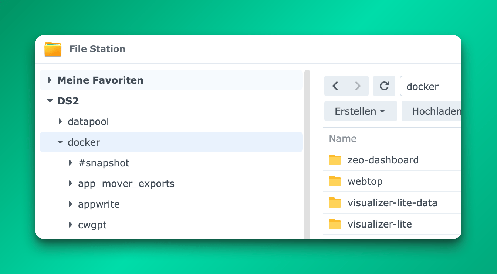
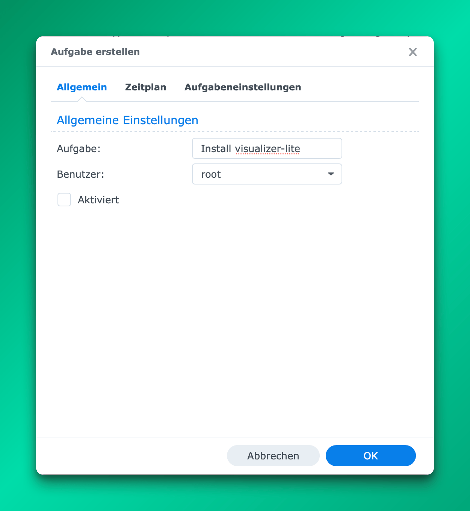
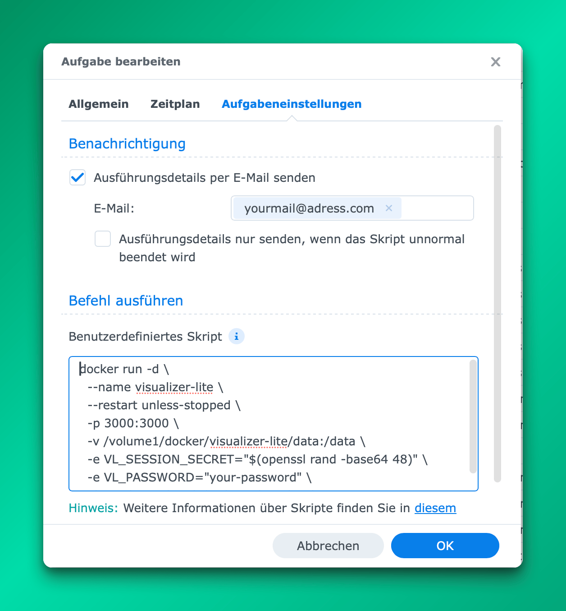
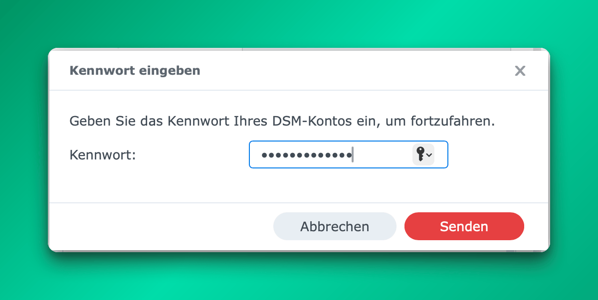
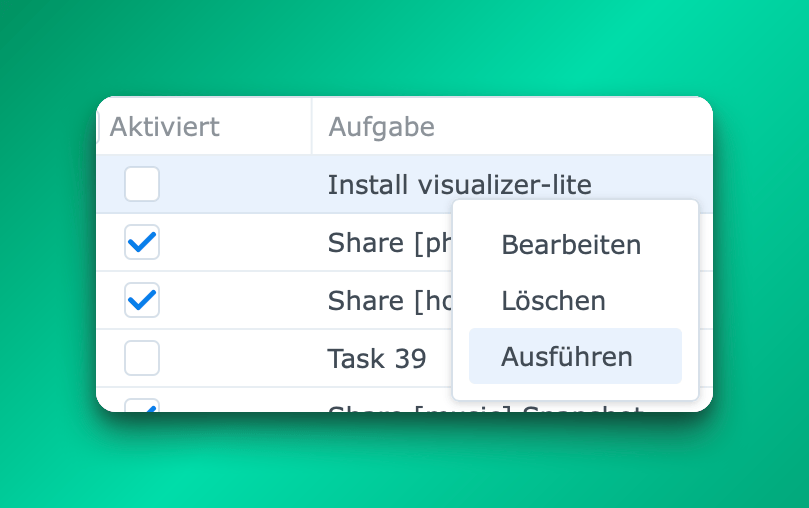

# Synology NAS — Visualizer Lite Installation

Es stehen zwei Installationsmethoden zur Verfügung. **Methode 1 (Task-Manager)** erfordert kein SSH und funktioniert vollständig über die Synology-DSM-Weboberfläche. **Methode 2 (SSH)** ist der klassische Kommandozeilen-Ansatz.

---

## Methode 1: Task-Manager (kein SSH erforderlich)

Diese Methode ist angelehnt an [Marius Bogdan Lucas Watchtower-Installationsanleitung](https://mariushosting.com/synology-30-second-watchtower-install-using-task-scheduler-docker/) und funktioniert vollständig innerhalb von DSM.

### Schritt 1 — Datenordner in der File Station erstellen

Die **File Station** öffnen, zum freigegebenen Ordner `docker` navigieren und folgende Ordnerstruktur erstellen:

```
docker/
└── visualizer-lite/
    └── data/
```

Zuerst den Ordner `visualizer-lite` erstellen, dann öffnen und darin den Unterordner `data` anlegen.



### Schritt 2 — Neue ausgelöste Aufgabe erstellen

**Systemsteuerung → Aufgabenplaner** öffnen, dann **Erstellen → Ausgelöste Aufgabe → Benutzerdefiniertes Skript** klicken.

Im Tab **Allgemein**:
- **Aufgabe:** `Install visualizer-lite`
- **Benutzer:** `root`
- **Aktiviert:** **deaktiviert** lassen (dies ist eine einmalige Einrichtungsaufgabe, kein Zeitplan)



### Schritt 3 — Installationsskript eingeben

Zum Tab **Aufgabeneinstellungen** wechseln und folgendes in das Feld **Benutzerdefiniertes Skript** einfügen:

```bash
docker run -d \
  --name visualizer-lite \
  --restart unless-stopped \
  -p 3000:3000 \
  -v /volume1/docker/visualizer-lite/data:/data \
  -e VL_SESSION_SECRET="$(openssl rand -base64 48)" \
  -e VL_PASSWORD="dein-passwort" \
  ghcr.io/tomschmidtdev/visualizer-lite:latest
```

`dein-passwort` durch ein sicheres Passwort nach Wahl ersetzen.

Optional **Ausführungsdetails per E-Mail senden** aktivieren und eine Adresse eintragen — hilfreich um zu bestätigen, dass die Aufgabe erfolgreich ausgeführt wurde.



Auf **OK** klicken. DSM fordert zur Bestätigung das DSM-Kontokennwort an.



### Schritt 4 — Aufgabe ausführen

In der Aufgabenplaner-Liste die Aufgabe **Install visualizer-lite** mit Rechtsklick auswählen und **Ausführen** klicken.



DSM lädt das Image von der GitHub Container Registry und startet den Container. Beim ersten Ausführen kann dies eine Minute dauern.

Im Browser `http://<NAS-IP>:3000` öffnen und mit dem gesetzten Passwort anmelden.

---

## Methode 2: SSH / Kommandozeile

Wer den klassischen Weg bevorzugt, kann per SSH auf das NAS zugreifen und die Befehle direkt eingeben.

### Schritt 1 — Datenverzeichnis erstellen

```bash
sudo mkdir -p /volume1/docker/visualizer-lite/data
```

### Schritt 2 — Container starten

```bash
sudo docker run -d \
  --name visualizer-lite \
  --restart unless-stopped \
  -p 3000:3000 \
  -v /volume1/docker/visualizer-lite/data:/data \
  -e VL_SESSION_SECRET="$(openssl rand -base64 48)" \
  -e VL_PASSWORD="dein-passwort" \
  ghcr.io/tomschmidtdev/visualizer-lite:latest
```

`dein-passwort` durch ein sicheres Passwort nach Wahl ersetzen.

Im Browser `http://<NAS-IP>:3000` öffnen.

---

## Parameter-Erläuterung

| Parameter | Was anpassen |
|---|---|
| `-v /volume1/docker/visualizer-lite/data:/data` | Der Pfad **links vom Doppelpunkt** gibt an, wo die Daten auf dem NAS gespeichert werden. Das `/data` rechts muss so bleiben. |
| `VL_SESSION_SECRET` | Langer, zufälliger String zum Signieren von Login-Sessions. Wird automatisch durch `openssl rand -base64 48` generiert. **Konsistent lassen** — eine Änderung meldet alle aktiven Sessions ab. |
| `VL_PASSWORD` | Das Login-Passwort. Kann später in den App-Einstellungen geändert werden. |
| `-p 3000:3000` | Der Zugriffsport (linke Seite). Auf z.B. `-p 8080:3000` ändern, wenn Port 3000 bereits belegt ist. |

---

## HTTPS (optional)

Bei Bedarf von HTTPS (z.B. für externen Zugriff) stehen zwei Optionen zur Verfügung:

**Option A — Synology Reverse Proxy (empfohlen)**
*Systemsteuerung → Anmeldeportal → Erweitert → Reverse Proxy* nutzen, um HTTPS extern zu verwalten. Der Container läuft intern auf HTTP — keine Änderungen am Installationsskript notwendig.

**Option B — Zertifikat direkt einbinden**
Ein Zertifikats-Volume hinzufügen und den Port ändern:

```bash
sudo docker run -d \
  --name visualizer-lite \
  --restart unless-stopped \
  -p 3443:3000 \
  -v /volume1/docker/visualizer-lite/data:/data \
  -v /volume1/docker/visualizer-lite/certs:/certs:ro \
  -e VL_SESSION_SECRET="$(openssl rand -base64 48)" \
  -e VL_PASSWORD="dein-passwort" \
  ghcr.io/tomschmidtdev/visualizer-lite:latest
```

Zertifikatsdateien ablegen unter:
```
/volume1/docker/visualizer-lite/certs/
├── fullchain.pem
└── privkey.pem
```

Das DSM-Zertifikat über *Systemsteuerung → Sicherheit → Zertifikat → Exportieren* herunterladen, dann:
```bash
cat cert.pem chain.pem > fullchain.pem
```

---

## Update

Auf die neueste Version aktualisieren:

```bash
docker pull ghcr.io/tomschmidtdev/visualizer-lite:latest
docker stop visualizer-lite
docker rm visualizer-lite
# docker run-Befehl aus dem Installationsschritt erneut ausführen
```

Die Daten in `/volume1/docker/visualizer-lite/data` bleiben bei Updates erhalten.

---

← [Zurück zur Haupt-README](../README.de.md)
